# Kết nối cảm biến chuyển động Xiaomi với Home Assistant

Như đã giới thiệu trong bài viết [Một số thiết bị SmartHome có sẵn trên thị trường](./Device.html), cảm biến chuyển động của XiaoMi sử dụng chuẩn giao tiếp Zigbee nên không thế kết nối được với bộ điều khiển trung tâm Home Assistant. Do đó, để kết nối được thiết bị này, cần phải sử dụng một thiết bị trung gian là USB CC2531 đã được giới thiệu trong [bài viết này](./Zigbee2MQTT.html).

Tuy nhiên, khi sử dụng USB CC2531 thì bộ điều khiển chỉ có thể nhận diện được thiết bị chứ thiết bị chưa thể kết nối được với Home Assistant. Vì thế trong bài hướng dẫn này, ta sẽ tìm hiểu cách kết nối cảm biến chuyển động sử dụng Zigbee với Home Assistant.

**Bước 1:** Thêm User mới trên HASS, **Username và Password là mqtt** sau đó restart HASS

**Configuration > Users > Dấu +** để tạo User mới

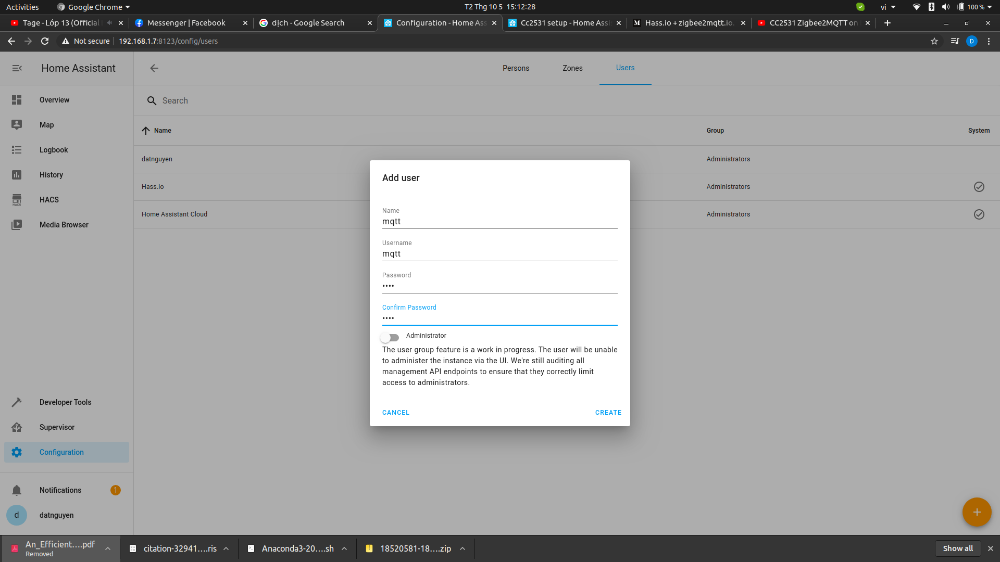

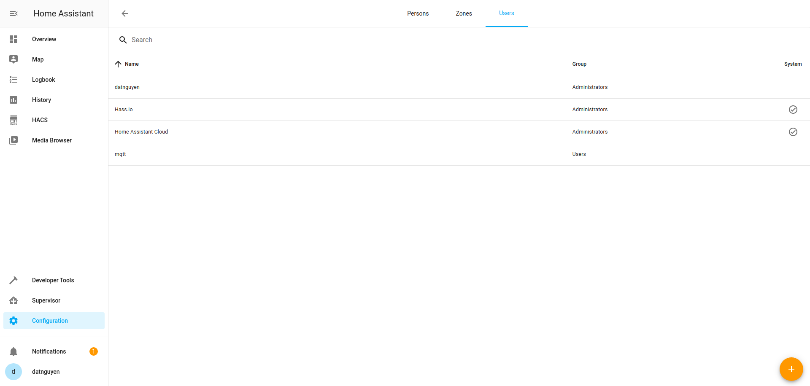

**Buớc 2:** Install Mosquitto Broker Add-on

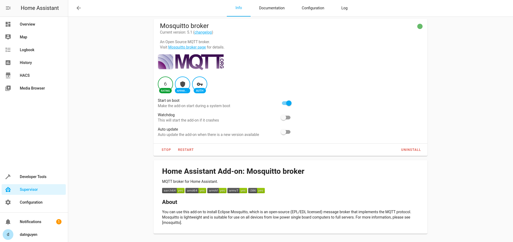

Thêm User và Password vào Configuration

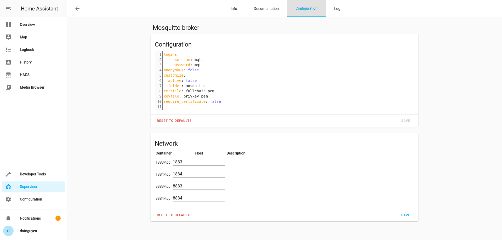

Nhấn **Save** để lưu Config

**Bước 3:** **Configuration > Integrations** và thiết lập Mosquito Integration.

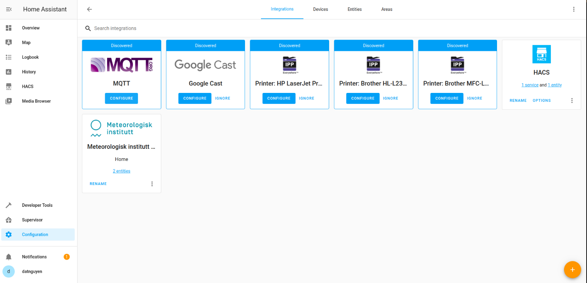

Chọn **Configure** tại ô MQTT

**Bước 4:** Install Zigbee2MQTT Add-on

URL: https://github.com/danielwelch/hassio-zigbee2mqtt

Thêm Repository URL tại **Supervisor > Add-on store > ⋮ > repositories:**

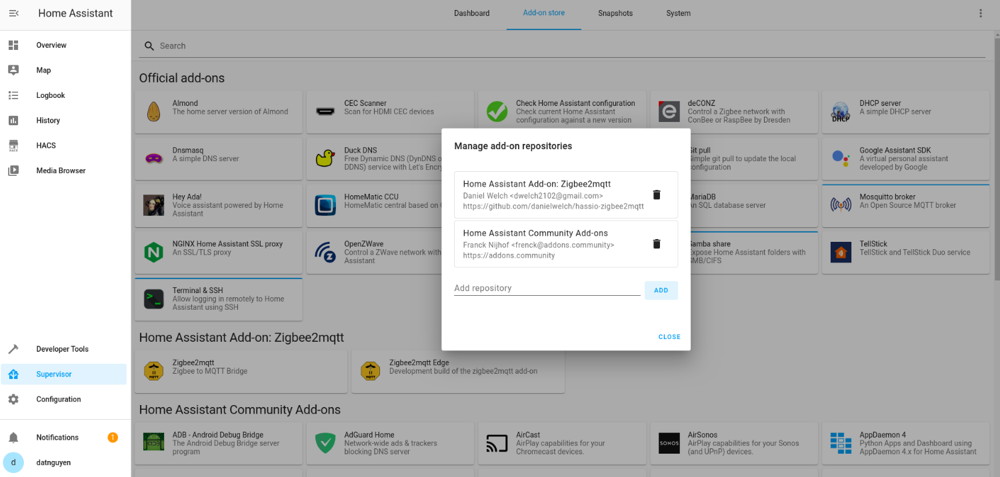

Install Zigbee2MQTT

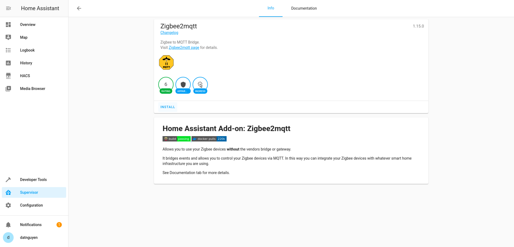

**Bước 5:** Khai báo Configure cho Zigbee2MQTT

```bash
user: mqtt
password: mqtt
server: mqtt://MY_IP:1883
```
MY_IP là IP của Raspberry Pi

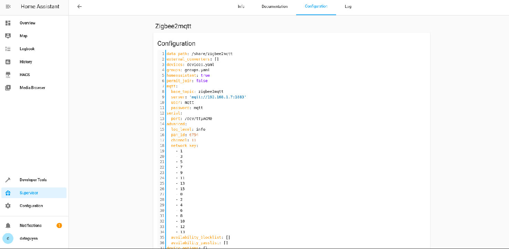

**Bước 6:** Kết nối USB zigbee CC2531 với HASS

**Supervisor > System > Host System > ⋮ hardware**

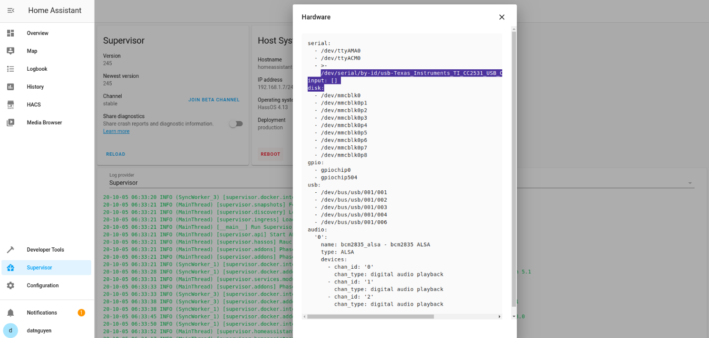

Copy tên thiết bị và paste vào Configure của Zigbee2MQTT Add-on

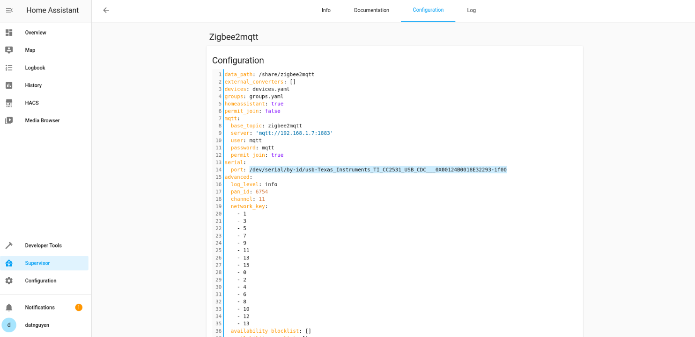

**Bước 7:** Thiết lập MQTT

**Configuration > Integrations > Mosquitto Broker > Configure > Re-configure** và khai báo

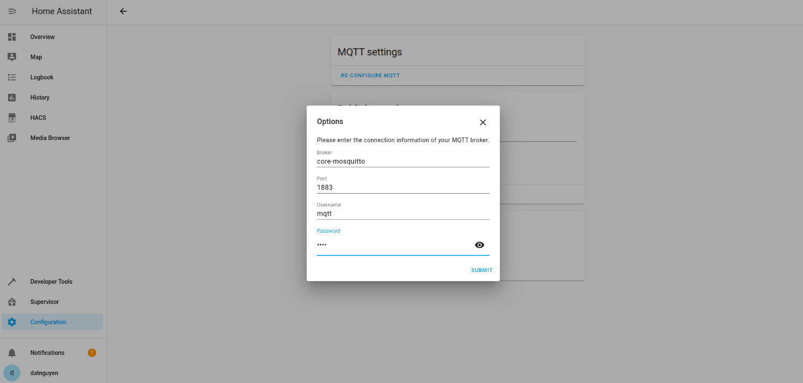

Click **Submit**

**Bước 8:** Kết nối cảm biến chuyển động với HASS

Tại **Configuration > Integrations** Nhẫn giữ nút nhấn trên cảm biến chờ một lúc để Mosquitto Broker phát hiện thiết bị mới.


Click **1 device** và thiết lập.

Đã kết nối thành công thiết bị với HASS

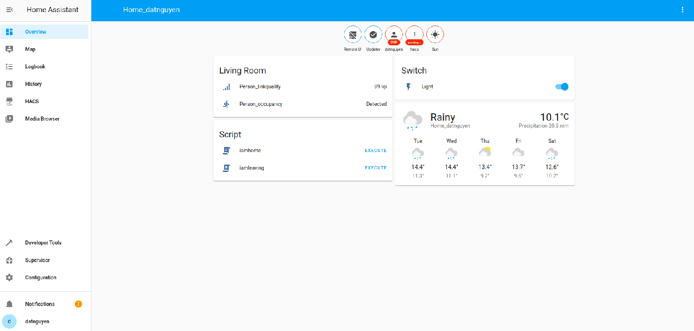
