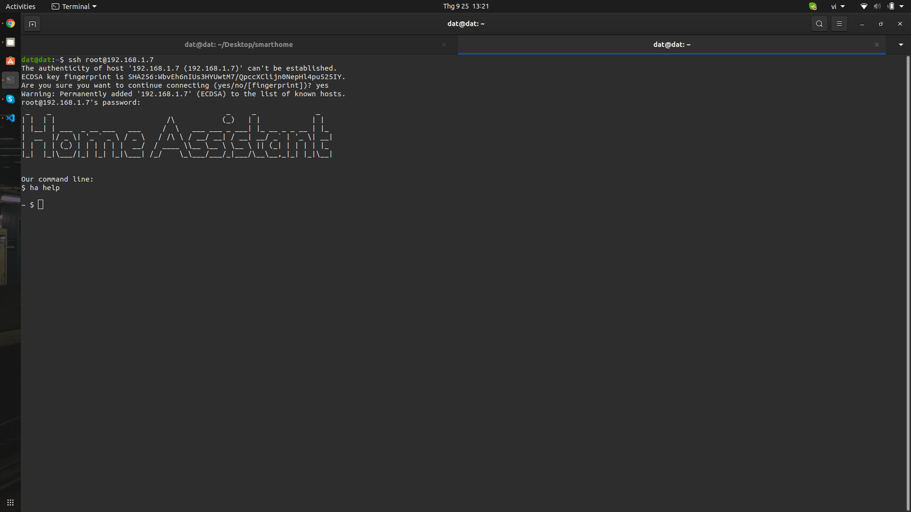

# Kết nối các thiết bị với Home Assistant
## Kết nối công tắc WiFi 1 Relay Sonoff Basic EWeLink với Home Assistant

Hiện tại Home Assistant không hỗ trợ kết nối trực tiếp với các thiết bị Sonoff vào hệ thống. Tuy nhiên, vẫn sẽ có cách để kết nối với Home Assistant và thông dụng nhất vẫn là **Flash Firmware Tasmota - Cập nhật lại chương trình mới cho thiết bị**, nhưng phương pháp này sẽ cần thêm một số thiết bị khác để hỗ trợ.

Link tham khảo **Flash Firmware Tasmota:** [tinhte.vn](https://tinhte.vn/thread/hass-huong-dan-flash-firmware-tasmota-cho-sonoff-t1-us.2930945/)

Vì cần thêm một số thiết bị khá là phức tạp, bài viết này sẽ hướng dẫn một cách thực hiện khác mà không cần phải tiến hành flash.

### Chuẩn bị

**Lưu ý:** File **Configuration.yaml**  là File mà chúng ta sẽ phải làm việc khá nhiều với nó, ở đây sẽ là nơi chúng ta khai báo và cấu hình các Components (Các thành phần ngoại vi kết nối vào hệ thống HASS).

**Có 2 cách để khai báo cấu hình**

**Cách 1: SSH**

Để SSH đến HASS ta cần Add-on **SSH-sever**

* Đầu tiên vào **Profile** để bật **Advanced Mode**


* Vào **Add-ons Store**, Click **Terminal & SSH** sau đó **Install**


* Qua Tag **Configuration** để điền password và click **Start**


* Trên máy tính Ubuntu, bật **Terminal** và tiến hành SSH. Để tìm kiếm IP của thiết bị có thể tham khảo tại [bài viết](./RaspberryUbuntu.html).
```bash
$ ssh root@ip
```
Nếu trên cửa sổ Terminal xuất hiện yêu cầu kết nối với địa chỉ IP của thiết bị, gõ **yes**. Nhập password vừa được cài đặt ở trên để tiến hành kết nối.



* Di chuyển vào thư mục **config** và sử dụng **vim editor** để khai báo

```bash
$ cd config
$ vim configuration.yaml
```


* Tiến hành khai báo


**Cách 2: Sử dụng Samba Add-on**

* Cài đặt Samba có thể tham khảo tại [bài viết](./SetupHASS.html).
* Vào **File** chọn **Other Locations**

Ở ô vuông góc dưới bên phải nhập smb://homeassistant. Nhấn **Connect** để thực hiện kết nối giữa máy tính với thiết bị.


Sau khi nhấn **Connect** máy tính sẽ dẫn đến thư mục **config on homeassistant** nhập **Username** và **Password** để có thể tiến hành truy cập.


Sử dụng **Text Editor** để khai báo trong file **configuration.yaml** tương tự như trên phần hướng dẫn với SSH.

### Thực hiện kết nối

**Bước 1:** Cài đặt HACS

**HACS** – viết tắt của **Home Assistant Community Store** là một **custom_component** dùng để cài đặt, quản lý các **custom_component** khác trên Home Assistant.

**Custom component** – Tích hợp mở rộng (hay không chính thức) là các component do cộng đồng/người dùng tạo ra để hỗ trợ hay thêm các tính năng mới cho Home Assistant nhưng không tích hợp chính thức vào HASS.

**LỢI ÍCH HACS MANG LẠI**

* Giúp khám phá các custom component hiện có hay tìm kiếm các component theo nhu cầu.
* Quản lý tất cả các custom component đã cài đặt qua HACS tại một giao diện duy nhất. Không cần phải theo dõi từng custom component để cập nhật nữa.
* Cài đặt, cập nhật, quay về phiên bản cũ hơn hay xoá các custom component trên giao diện thay vì chép, xoá file trực tiếp trong thư mục config của HASS.
* Nếu một component không có trên HACS, bạn có thể thêm nó vào danh sách để cài đặt hay cập nhật từ HACS.

**Cài Đặt HACS**

* Tải về file **hacs.zip**: [link](https://github.com/hacs/integration/releases/tag/1.6.0)
* Sau khi tải về, giải nén file hacs.zip, được thư mục hacs. Copy và paste cả thư mục hacs này vào thư mục /config/custom_components (lưu ý có kí tự s) của Hass.

Nếu chưa có thư mục **custom_components**, tạo mới rồi copy/paste vào bên trong thư mục vừa tạo. Chắc chắn rằng hacs nằm bên trong custom_components và thư mục custom_components nằm trong /config, cùng với file cấu hình chính configuration.yaml.


Kiểm tra và khởi động lại HASS bằng cách truy cập trở lại HASS, vào phần **Configuration > General > Sever Control > Check Config**. Nếu hệ thống báo **Configuration Valid!** thì xem như chúng ta đã thành công.

Sau đó nhấn vào **Restart** để khởi động lại HASS


**Bước 2:** LẤY API TOKEN TỪ GITHUB

Trong lúc chờ **HASS khởi động**, tạo API Token (khoá truy cập dịch vụ) của Github để dùng khi cấu hình HACS.

* Nếu đã tạo tài khoản Github ở bước trên, truy cập [Github Tokens](https://github.com/settings/tokens) và đăng nhập tài khoản Github. Nếu chưa, bạn chọn Create an account để tạo tài khoản.
* Chọn Generate Token để tạo API Token.

Nhập lại mật khẩu Github lần nữa để xác nhận muốn API Token. HACS cần khoá này để thực hiện các tính năng chuyên biệt do Github cung cấp (như clone repository) và lưu khoá này trên máy chủ HASS. Nếu tài khoản của bạn có nhiều thông tin quan trọng, nên tạo một tài khoản mới.

Nhập một tên gợi nhớ vào mục Note để dễ quản lý sau này rồi kéo xuống và bấm **Generate Token**. Các lựa chọn khác để mặc định hoặc bỏ trống.


Copy lại token này để dùng trong mục cấu hình HACS tiếp theo

**Bước 3:** THÊM HACS VÀO HOME ASSISTANT VÀ CẤU HÌNH

* Sau khi HASS khởi động xong ở bước trên, vào **Configuration > Integrations**, Chọn Thêm (Dấu cộng) để thêm mới một Integration rồi nhập HACS vào ô tìm kiếm.


Nếu không tìm thấy HACS như ảnh, bạn hãy xoá bộ nhớ đệm của trình duyệt web rồi tải lại trang giao diện của HASS và làm lại:
* Trong Safari: vào Preferences, Advanced, Show develop menu …, Develop, Empty Caches.
* Trong Chrome: vào More Tools, Clear browsing data.

Click **HACS** để thêm HACS vào HASS. Tuỳ vào tốc độ của máy chủ HASS và kết nối internet sẽ ảnh hưởng đến quá trình install HACS


* Paste API Token từ github và submit rồi click **Finish**

**Bước 4:** Install Sonoff

* Ở cột bên trái xuất hiện **HACS**, click **HACS** và vào **Integrations**
* Vào **Custom Repositories** và thực hiện theo trình tự


Tìm kiếm **AlexIT/SonoffLAN**, ở mục category chọn **Integration**


Sau đó tiến hành install Sonoff và Restart HASS


**Bước 5:** Khai báo **Configuration.yaml**

```bash
sonoff:
  username: mymail@gmail.com
  password: mypassword
```

**Chú ý:** username và password là tài khoản đăng nhập EWeLink

**Bước 6:** Kiểm tra thiết bị

* Vào Developer Tools
* Tại filter nhập **sonoff** sẽ thấy thiết bị của bạn


* Click vào thiết bị và tiến hành test of/off


**Đã hoàn thành kết nối công tắc Sonoff với Home Assistant**
