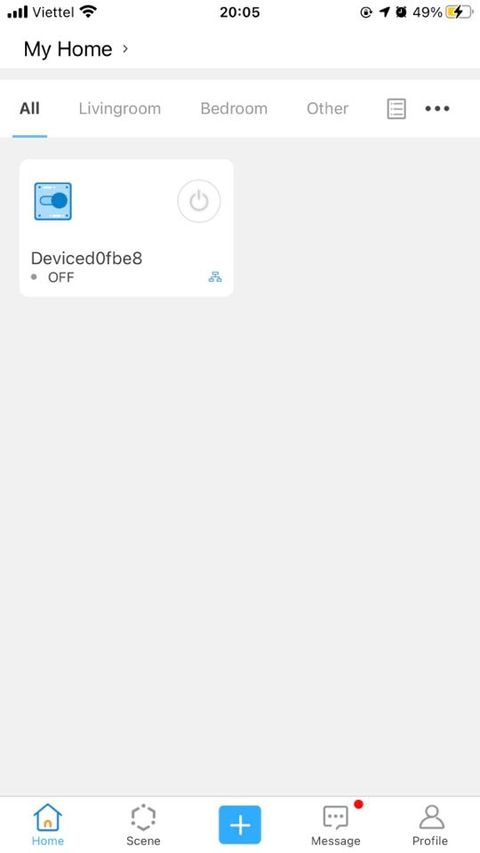

# Một số thiết bị SmartHome có sẵn trên thị trường

Hiện nay, trên thị trường có rất nhiều thiết bị hỗ trợ các phương thức truyền thông khác nhau như WiFi, Zigbee, Bluetooth... có thể sử dụng trong hệ thống SmartHome. Để tích hợp các thiết bị này vào hệ thống SmartHome cần phải thiết lập kết nối cho từng thiết bị.

## Công tắc WiFi 1 Relay Sonoff Basic EWeLink

**Hướng dẫn thiết lập**

* Tải ứng dụng **EWeLink** lên Smartphone

* Sau khi cài đặt hoàn tất, khởi động EWeLink.
* Nếu bạn đã có tài khoản EWeLink thì có thể bỏ qua bước này và tiến hành đăng nhập. Còn nếu chưa thì cần phải đăng ký tài khoản trước:

Click **Create new account**

Chọn quốc gia

Nhập Email

Sau đó hệ thống sẽ gửi mã xác thực đến Email của bạn. Tiến hành nhập mã xác thực và cài đặt Password

Vậy là ta đã hoàn thành các bước đăng ký tài khoản. Bạn cần đăng nhập lại với tài khoản mới được tạo.

* Trên thiết bị, cấp nguồn 220V vào đầu vào **Input**, đèn trên thiết bị bắt đầu nhấp nháy.
* Để kết nối với thiết bị, ấn giữ nút config cho đến khi đèn **nhấp nháy 3 lần** và tiến hành các bước sau trên EWeLink.

Click **Add**

Click **Quick Pairing**

Click **Add one device**

Chọn WiFi và nhập Password

Chờ đến khi việc kết nối hoàn thành

Đặt tên thiết bị và click **Done**

Chọn thiết bị của bạn và tiến hành sử dụng

## Cảm biến chuyển động Xiaomi Mijia

Để có thể nhận biết được sự hiện diện của con người trong phòng thì việc sử dụng cảm biến chuyển động là một phương án có thể được nghĩ tới. Và khi đó, có thể thực hiện được nhiều thao tác được cài đặt sẵn như bật đèn, điều khiển nhiệt độ máy lạnh thích hợp... khi có người, hoặc khi không có người sẽ tắt toàn bộ thiết bị mà không cần bất cứ hành động nào để điều khiển chúng.

Nguồn: [mihub.vn](https://mihub.vn/san-pham/cam-bien-nhiet-chuyen-dong-xiaomi-mijia/)

Để sử dụng thiết bị, chúng ta có thể sử dụng **Xiaomi gateway**

Link tham khảo sử dụng Xiaomi gateway để kết nối với các thiết bị Zigbee: https://mihub.vn/huong-dan-su-dung-ung-dung-mi-home-phan-mem-quan-ly-he-sinh-thai-nha-thong-minh-xiaomi

Hoặc **Có thể sử dụng USB Zigbee CC2531 thay thế Xiaomi gateway**

Tham khảo bài biết hướng dẫn [Cài đặt Zigbee2MQTT và kết nối với thiết bị Zigbee thông qua Zigbee gateway (Zigbee2MQTT + CC2531)](./Zigbee2MQTT.html) trong cùng Series SmartHome

## Broadlink RM Pro

Ngoài những thiết bị điều khiển trực tiếp như bật/tắt đèn, quạt... thì trong mỗi gia đình không thể không có những thiết bị được điều khiển thông qua Remote như TV, điều hòa... Tuy nhiên, mỗi thiết bị đều có 1 Remote riêng để điều khiển và tùy theo mỗi hãng sản xuất khác nhau lại đều có nhưng phương pháp điều khiển khác nhau. Trên thị trường hiện nay cũng có khá nhiều Remote có tính năng học lệnh từ các Remote khác nhưng lại không thể tích hợp được vào hệ thống SmartHome để điều khiển một cách dễ dàng.

Một giải pháp vừa có thể học lệnh từ các Remote vừa có thể tích hợp trong hệ thống SmartHome đó là sử dụng **Broadlink**.

**Hướng dẫn thiết lập**

* Tải ứng dụng **Intelligent Home Center** trên Smartphone

* Sau khi cài đặt hoàn tất, khởi động **Intelligent Home Center** và tiến hành thiếp lập các bước ban đầu

Click **Get started**

Chọn khu vực quốc gia

Click **Add device**

Chọn thiết bị mà bạn sử dụng. Cụ thể là **Universal Remotes**

Chọn tiếp model mà bạn sử dụng. Cụ thể là **RM pro/pro+**

Click **Next**

Cài đặt WiFi và Password

Chờ thiết bị kết nối thành công

Đặt tên thiết bị và khu vực sử dụng

Sau khi thành công sẽ thấy thiết bị ở màn hình chính

## Cảm biến rung Aqara (Vibration sensor)

 Cảm Biến Rung Chuyển Động Xiaomi Aqara là thiết bị giúp người dùng phát hiện nhanh các chuyển động bất thường. Cho phép bạn giám sát và bảo vệ căn nhà của bạn khởi những nguy cơ tìm ẩn từ môi trường xung quanh. Sản phẩm sử dụng kết nối không dây Zigbee

 Cảm biến hỗ trợ 3 mức cảm biến lực khác nhau, chính vì thế, thông qua ứng dụng trên điện thoại, người dùng có thể thiết lập mức độ cảm biến khác nhau cho từng khu vực trong nhà. Việc này giúp nâng cao độ chính xác của cảm biến, cũng như hạn chế những báo động không mong muốn gây ra bởi những tác nhân vô hại như trẻ con hoặc thú cưng.

### Tính năng:
* Một thiết bị thông minh ít tiêu tốn năng lượng, chi phí thấp kết nối không dây Zigbee.

* Sử dụng nguồn CR2032 pin, và phù hợp với Zigbee của HA1.2 (nhà tự động hóa) tiêu chuẩn.

* Có thể interoperate với Aqara đa chức năng cửa ngõ và các thiết bị thông minh khác.

* Dùng để theo dõi cửa và cửa sổ, vật dụng quan trọng báo động, cũng có thể theo dõi thành giường của hoạt động, giúp xác định chất lượng của giấc ngủ.

* Kết hợp độ chính xác cao 6 trục gia tốc và con quay hồi chuyển, sử dụng cho thu ngoài rung và Motion dữ liệu.

* Nhiệt độ: -10 đến 50 Độ C.

Nguồn: [aliexpress.com](https://vi.aliexpress.com/i/32947409952.html)

Để sử dụng thiết bị, chúng ta có thể sử dụng **Xiaomi gateway**

Link tham khảo sử dụng Xiaomi gateway để kết nối với các thiết bị Zigbee: https://mihub.vn/huong-dan-su-dung-ung-dung-mi-home-phan-mem-quan-ly-he-sinh-thai-nha-thong-minh-xiaomi

Hoặc **Có thể sử dụng USB Zigbee CC2531 thay thế Xiaomi gateway**

Tham khảo bài biết hướng dẫn [Cài đặt Zigbee2MQTT và kết nối với thiết bị Zigbee thông qua Zigbee gateway (Zigbee2MQTT + CC2531)](./Zigbee2MQTT.html) trong cùng Series SmartHome

## Cảm biến Cửa Aqara (Door sensor)

 Cảm biến cửa sổ này có thể phát hiện việc đóng mở cửa và cửa sổ bằng cách cảm nhận sự gần xa của cảm biến và nam châm. Nó sẽ gửi thông báo đến điện thoại của bạn qua APP khi có chuyển động.

### Tính năng:
* Phát hiện đóng mở cửa ra vào và cửa sổ sau đó gửi thông báo lên app.

* Kết nối Zigbee không dây.

* Gồm có 1 cảm biến chính và một nam châm.

* Kích thước nhỏ, dễ dàng lắp đặt và sử dụng.

* Khoảng cách cảm biến: 22mm.

* Nhiệt độ làm việc: -10 - 50 Độ C.

* Độ ẩm làm việc: 0 - 95pct RH.

* Xây Dựng-Trong 1PC CR1632 Cell Pin.

Nguồn: [aliexpress.com]](https://vi.aliexpress.com/i/32947409952.html)

Để sử dụng thiết bị, chúng ta có thể sử dụng **Xiaomi gateway**

Link tham khảo sử dụng Xiaomi gateway để kết nối với các thiết bị Zigbee: https://mihub.vn/huong-dan-su-dung-ung-dung-mi-home-phan-mem-quan-ly-he-sinh-thai-nha-thong-minh-xiaomi

Hoặc **Có thể sử dụng USB Zigbee CC2531 thay thế Xiaomi gateway**

Tham khảo bài biết hướng dẫn [Cài đặt Zigbee2MQTT và kết nối với thiết bị Zigbee thông qua Zigbee gateway (Zigbee2MQTT + CC2531)](./Zigbee2MQTT.html) trong cùng Series SmartHome
