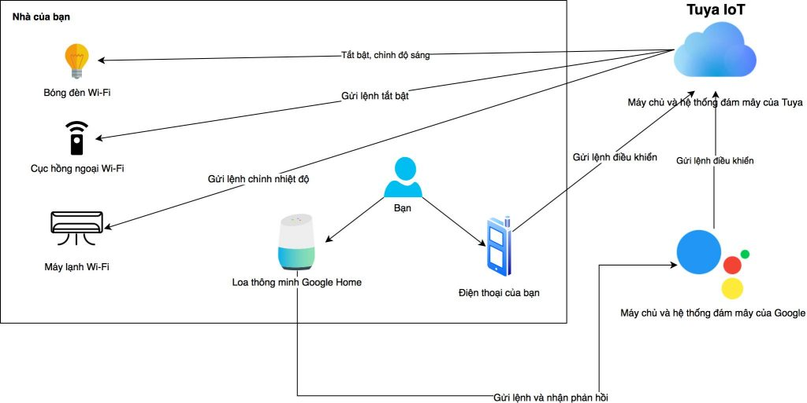
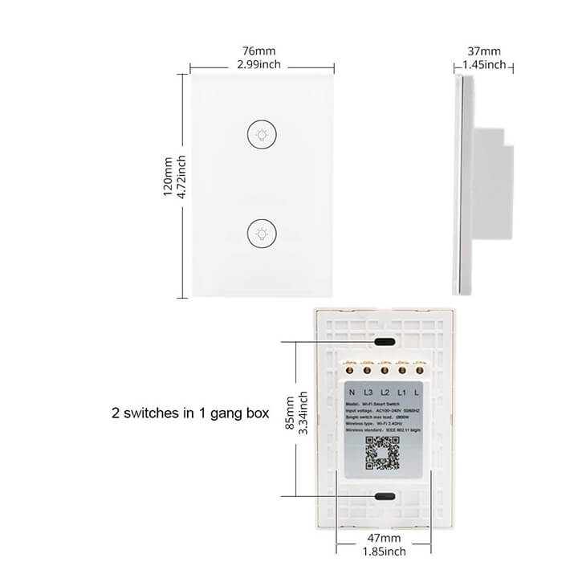
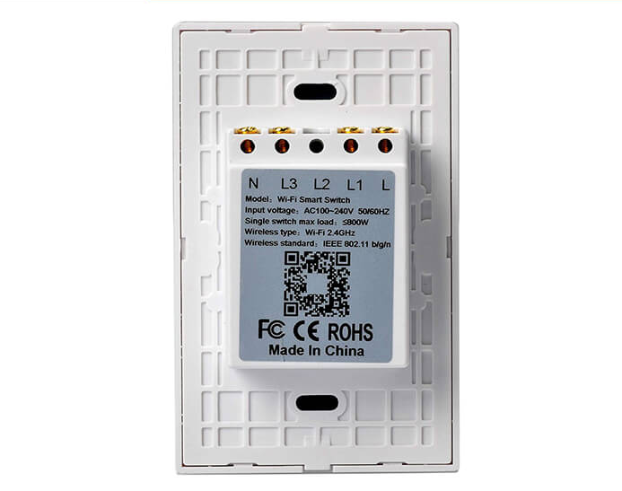
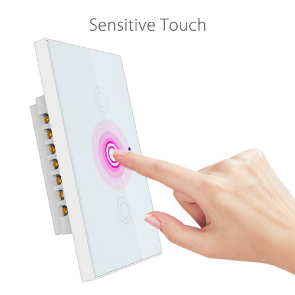
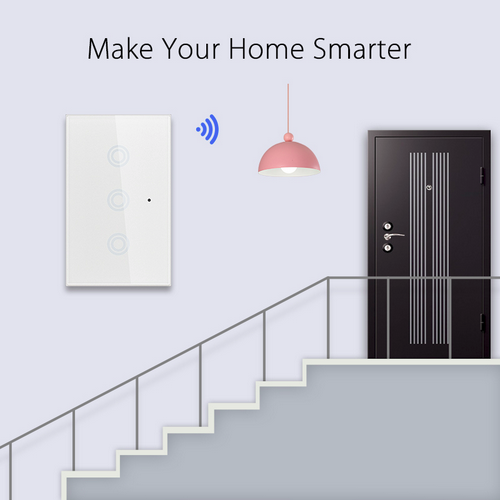
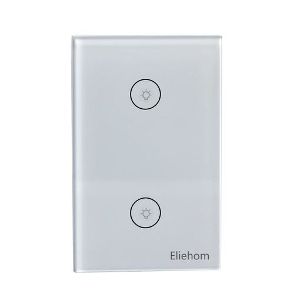

# Giới thiệu về Tuya và Một số thiết bị Tuya

## I. Tuya là gì?

* Tuya hay Tuya Smart là một chuẩn công nghệ IoT (Internet of Things - Internet vạn vật) hiện đã phổ biến trên thế giới. Dựa trên chuẩn công nghệ Tuya, các nhà sản xuất có thể tạo nên các sản phẩm công nghệ IoT và phần mềm điều khiển của mình.

  

* Trong hệ sinh thái Tuya có rất nhiều thiết bị tiêu biểu trong số đó như : điều khiển hồng ngoại từ xa, bóng đèn, máy lạnh, ổ cắm thông minh, công tắc thông minh, các cảm biến nhiệt độ, cảm biến chuyển động, cảm biến khói...

## II. Cách hoạt động của Tuya

* Tuya sẽ cung cấp các dịch vụ online, máy chủ, các dịch vụ cloud và những thứ cần thiết về phần mềm, bao gồm luôn cả app di động để điều khiển thiết bị SmartHome.

* Để có thể sử dụng các dịch vụ do Tuya cung cấp thì các nhà sản xuất OEM ( Original Equipment Manufacturer hay còn gọi là nhà sản xuất thiết bị gốc ), họ sẽ phải tích hợp phần cứng của họ với Tuya.

  

## III. Dòng sản phẩm và các giải pháp thông minh của Tuya Smart

### 1. Dòng sản phẩm và giải pháp

* Smart Plug

    *Plug, Power Strip, Wallsocket*

* Smart Switch

    *Wall Switch, Dimmer Switch, Curtain Switch, Fan Switch, Rail Switch*

* Smat Light

    *Down light, Bulb, Ceiling lamp*

* Light Strip

    *LED strip*

* Light Fixture

    *Tablelamp, Scene light*

* Air Conditioner

    *Package Air Conditioner, Portable Air Conditioner*

* Air Cooler/Fan

* Robot Cleaner

* Air Purifier

    *Humidifier, Aromatherapy Diffusers*

* Security Camera

* Door Bell

* Household Appliances

    *Air purifier, Sweeper, Heater, Mosquito lamp, Milking machine*

* Kitchen Applicances

    *Tea Machines, Water Dispensers*

### 2. Nền tảng tương thích

* Amazon Echo

* IFTTT

* Google Nest

* Tmall Genie

* Siri

* Baidu DuerOS

* Rokid

* JD DingDong

* Tencent Xiaowei

## IV. Công tắc âm tường thông minh WiFi Tuya

### 1. Giới thiệu :

* Công tắc thông minh Tuya có bề mặt là kính cường lực, nút nhấn cảm ứng. Cho người dùng một trải nghiệm chân thực khi bật tắt các thiết bị. Ngoài ra công tắc Tuya còn có thể kết nối WiFi và thông qua các ứng dụng của Tuya trên điện thoại thông minh, người dùng có thể điều khiển các thiết bị ở bất kỳ đâu chỉ cần điện thoại có kết nối Internet.

  

* Công tắc Tuya sử dụng đế âm tiêu chuẩn thông dụng tại Việt Nam, lắp đặt dễ dàng, cài đặt đơn giản trong vòng 1 phút. Chúng ta chỉ cần thay mặt công tắc đang dùng bằng công tắc Tuya, tận dụng đường dây diện có sẵn như vậy thì chúng ta đã có thể sở hữu cho căn nhà của mình một thiết bị thông minh.

  

* Có 3 phiên bản nút nhấn

  

### 3. Một số tính năng chính

* Mang đến cho người dùng một trải nghiệm chân thực và an toàn. Công tắc được thiết kế bằng công nghệ cảm ứng điện dung, chạm nhẹ ngón tay để điều khiển tắt mở các đèn và thiết bị điện khác trong nhà một cách dễ dàng và an toàn.

  

* Tiết kiệm thời gian khi lắp đặt, công tắc hoạt động không cần qua các HUB điều khiển trung tâm mà kết nối trực tiếp với WiFi.

  

* Một tiện ích thông minh, khi đi xa, bạn vẫn có thể tắt/mở đèn cho ngôi nhà mình hoặc có thể dễ dàng theo dõi trạng thái của các thiết bị trong nhà. Ngoài ra bạn còn có thể lên lịch trình tắt mở nguồn thiết bị điện một cách tự động theo ý muốn, như là bật đèn khi trời tối và tắt đèn khi trời sáng.

  

* Công nghệ "thân thiện" dễ dàng mở rộng tiện ích, kết nối với thiết bị khác như trợ lý ảo của Google và Amazon.

  

* Sở hữu một thiết kế thời trang, làm tăng giá trị cho ngôi nhà của bạn.

  

