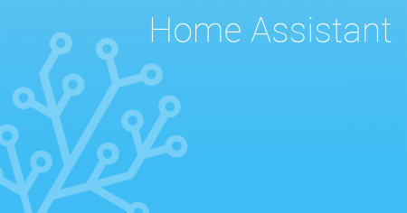
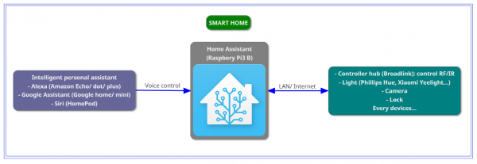
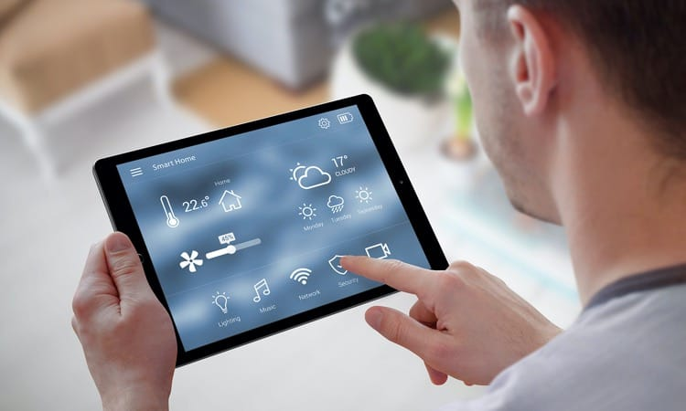

# Giới thiệu về Home Assistant

## Home Assistant (HASS) là gì?

Home Assistant là một hệ thống tự động hóa ngôi nhà thông minh mã nguồn mở và miễn phí được thiết kế để trở thành hệ thống điều khiển trung tâm trong hệ thống Smart Home. Hệ thống được viết trên nền tảng Python 3, với trọng tâm chính là kiểm soát cục bộ và tính bảo mật cao.

Home Assistant được thiết kế để dễ dàng triển khai trên nhiều thiết bị như máy tính nhúng Raspberry Pi, Orange PI... hay trên máy tinh để bàn, các thiết bị lưu trữ (NAS) hay thậm chí là trên Container Docker.

Cho đến thời điểm hiện tại Home Assistant hỗ trợ đến 1600 model thiết bị tích hợp sẵn các hệ thống và dịch vụ IoT khác nhau dưới dạng "intergation component" - "thành phần tích hợp". Các hành động như điều khiển ánh sáng, không khí, hệ thống giải trí, điều khiển từ xa ... có thể kích hoạt tự động bằng tập lệnh, giọng nói, ứng dụng di động hoặc được điều khiển qua trình duyệt Web Home Assistant.

Dự án Home Assistant được bắt đầu từ tháng 9 năm 2013, do Paulus Schoutsen khởi xướng. Cho đến nay đã có trên 1930 nhà phát triển đã đóng góp vào hệ thống. Bên cạnh đó, dự án còn có các ứng dụng mã nguồn mở và miện phí trên iOS và Android.

Trích dẫn trên [Wiki Pedia](https://en.wikipedia.org/wiki/Home_Assistant)

Trang chủ [Home Assistant](https://www.home-assistant.io)

## Tính năng

Home Assistant hoạt động như một trung tâm điều khiển nhà thông minh có tất cả các chức năng phổ biến mà bạn mong đợi từ một nền tảng Home Automation.
* Quản lý cảnh báo của hệ thống an ninh, giám sát các thiết bị đo năng lượng và các loại cảm biến khác.
* Cung cấp các hệ thống dự trên hành động và tập lệnh để tự động hóa, xử lý các sự kiện, cài đặt thời gian hoạt động, đặt lịch cho các tác vụ, thông báo, điều khiển bằng giọng nói cũng như các chức năng cho phép tác động trực tiếp hay theo yêu cầu.
* Được triển khai như một hệ thống tại chỗ, có thể kết nối trực tiếp hoặc gián tiếp với các thiết bị IoT cục bộ, các Gateway/Hub/Bridge hoặc các Cloud từ nhiều nhà cung cấp khác nhau, bao gồm hệ sinh thái Smart Home đóng và mở khác.
* Tích hợp nhiều thiết bị, dịch vụ và hệ sinh thái IoT phổ biến như: Amazon Alexa, Apple HomeKit, Bluetooth, ecobee, Google Assistant, Google Cast (Google Chromecast), Google Home, Google Nest, IFTTT, IKEA Smart Home , KNX, Xiaomi Smart Home (Mi Home), MQTT, Philips Hue, SmartThings (Samsung), Sonoff (eWeLink, chế độ DIY hay chương trình từ bên thứ 3), Sonos, Tuya Smart, X10, Zigbee, Z-Wave, một số Smart Locks từ Yale/August và nhiều bên thứ 3 khác.

* Cung cấp hệ thống điều khiển qua web hoặc ứng dụng trên iOS, Android cho phép theo dõi tình trạng của tất cả các thiết bị trong nhà. Nhờ đó có thể điều khiển tất cả các thiết bị từ một giao diện duy nhất và lưu trữ tất cả các hoạt động của người dùng trên máy chủ, đảm bảo tính bảo mật cao.
* Ngoài ra hệ thống còn dễ dàng thiết kế các kịch bản điều khiển thiết bị một cách thông minh giúp ngôi nhà của bạn trở nên hoàn toàn tự động và dễ dàng kiểm soát.

* Một ví dụ cơ bản như tích hợp bóng đèn Philips Hue vào hệ thống, ta cần điều khiển màu sắc của đèn, có thể bật/tắt hoặc đọc trạng thái của đèn. Home Assistant cung cấp các tính năng cho mọi thiết bị, dịch vụ được hỗ trợ, hay truy cập dễ dàng vào các nhóm thành phần như ánh sáng, nhiệt độ, công tắc, đóng mở cửa.... Quá trình thiết lập cũng dễ dàng nhờ khả năng phát hiện nhiều loại thiết bị khác nhau. Nếu có một thiết bị được hỗ trợ, thì việc thiết lập nó gần như là một quá trình tự động.

Tóm lại: Home Assistant là một hệ thống điều khiển ngôi nhà thông minh một cách vượt trội, dễ dàng kết nối và quản lý thiết bị thông minh, tính bảo mật cao, có thể tích hợp được trên nhiều thiết bị khác nhau.
