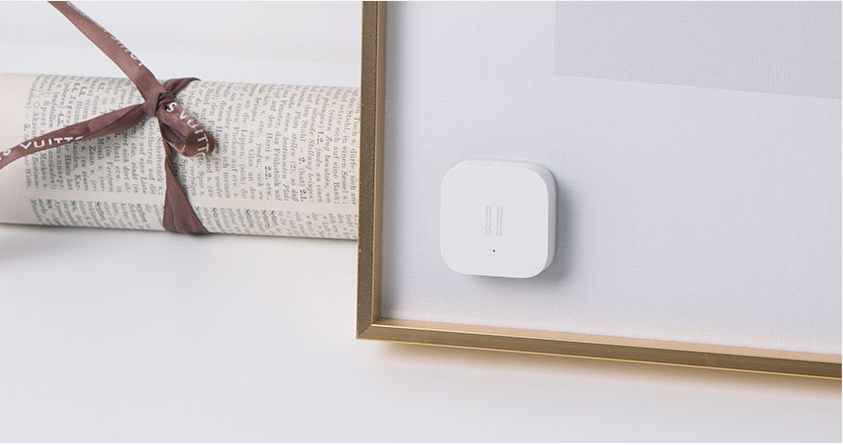

# Giải pháp an ninh cho ngôi nhà

## 1. Cảm biến rung Aqara (Aqara vibration sensor)

### Giới thiệu

Cảm Biến Rung Xiaomi Aqara là thiết bị giúp người dùng phát hiện nhanh các chuyển động bất thường. Cho phép bạn giám sát và bảo vệ căn nhà của bạn khởi những nguy cơ tìm ẩn từ môi trường xung quanh. Sản phẩm sử dụng kết nối không dây Zigbee.

Cảm biến hỗ trợ 3 mức cảm biến lực khác nhau, chính vì thế, thông qua ứng dụng trên điện thoại, người dùng có thể thiết lập mức độ cảm biến khác nhau cho từng khu vực trong nhà. Việc này giúp nâng cao độ chính xác của cảm biến, cũng như hạn chế những báo động không mong muốn gây ra bởi những tác nhân vô hại như trẻ con hoặc thú cưng.

### Giải pháp an ninh

* Lắp đặt ở vị trí cửa kính ban công, cửa sổ để phát hiện vỡ kính

* Lắp đặt ở cửa tủ, ngăn kéo

* Lắp ở các tài sản có giá trị như đồ cổ, tranh vẽ

## 2. Cảm biến chuyển động Aqara (Aqara motion sensor)

### Giới thiệu

Để có thể nhận biết được sự hiện diện của con người trong phòng thì việc sử dụng cảm biến chuyển động là một phương án có thể được nghĩ tới. Và khi đó, có thể thực hiện được nhiều thao tác được cài đặt sẵn như bật đèn, điều khiển nhiệt độ máy lạnh thích hợp... khi có người, hoặc khi không có người sẽ tắt toàn bộ thiết bị mà không cần bất cứ hành động nào để điều khiển chúng. Thiết bị sử dụng kết nối không dây zigbee

### Giải pháp an ninh

Có thể lắp đặt ở tất cả các vị trí mà bạn mong muốn như:

* Lắp đặt ở vị trí gần cửa ra vào hoặc cửa sổ. Khởi động khi ra ngoài để phát hiện người khác xâm nhập vào nhà.

* Lắp đặt ở các nơi chứa các đồ vật có giá trị.

Các cách lắp đặt:

## 3. Cảm biến cửa Aqara (Aqara Door sensor)

### Giới thiệu

Cảm biến cửa có thể phát hiện việc đóng mở cửa và cửa sổ bằng cách cảm nhận sự gần xa của cảm biến và nam châm. Nó sẽ gửi thông báo đến điện thoại của bạn qua App khi có chuyển động. Bộ cảm biến gồm 1 cảm biến chính và một nam châm. Thiết bị sử dụng kết nối không dây Zigbee.

### Giải pháp an ninh

* Đặt ở vị trí cửa ra vào và cửa sổ phát hiện người xâm nhập.

## 4. Camera Aqara

### Giới thiệu

Camera Aqara G2H là một trong những sản phẩm bảo mật được mong đợi nhất trong năm nay vì khả năng tương thích Apple Homekit. Với các tính năng đặc biệt:

* Ghi hình 1080p full HD và chế độ ghi hình đêm.

* Hỗ trợ lưu trữ bằng nhiều cách: thẻ SD, NAS và Cloud.

* Camera góc quay rộng 140 độ, dễ lắp ở nhiều vị trí.

* Nhận diện thông minh với trí tuệ nhân tạo AI.

* Giao tiếp hai chiều, âm thanh rõ ràng.

* Có thể kếp hợp với các thiết bị thông minh khác:

* * Chụp lại hình ảnh khi có ai đó xâm nhập vào nhà bạn với bất kì cánh cửa nào khi phát hiện cửa mở với cảm biến cửa Aqara.

* * Bật đèn khi phát hiện có người đi qua (Đèn Philips Hue + Camera).

* * Tắt máy lạnh khi không có người trong nhà (Camera + Điều khiển máy lạnh Aqara Air P3).

* * Bật chế độ an ninh khi không có ai ở nhà (Aqara Secure Kit + camera).

* * Tắt toàn bộ đèn và tự động khóa nhà khi tất cả mọi người rời khỏi nhà. Thiết bị tham khảo: Công tắc thông minh Aqara cho đèn, Khóa thông minh Aqara N100, Aqara Kit và Camera.

* Thiết bị có thể sử dụng kết nối không dây WiFi hoặc Zigbee.

### Giải pháp an ninh

* Có thể lắp đặt ở các vị trí gần cửa ra vào, phòng khách, phòng làm việc, hoặc ở vị trí sảnh trước nhà.

## 5. Cảm biến tràn nước (Aqara water leak sensor)

### Giới thiệu

Nước tràn từ nhà tắm hoặc bồn chứa nước do người dùng quên tắt. Đây là một trong những vấn đề khá phổ biến và rất nhiều người gặp phải. Nó không chỉ ảnh hưởng đến các vât dụng đồ dùng khác trong nhà và thậm chí còn có thể gây chập điện rất nguy hiểm. Mà hơn thế nó là một trong những nguyên nhân của tình trạng lãng phí nước hiện nay. Chính vì lý do này, cảm biến tràn nước Aqara đã ra đời. Như một giải pháp tối ưu để chấm dứt những vấn đề trên. Thiết bị sử dụng kết nối không dây Zigbee.

### Giải pháp an ninh

* Lắp đặt ở những nơi có khả năng tràn nước: phòng tắm, tầng hầm, nhà bếp.

## 6. Cảm biến khói Aqara (Aqara smoke sensor)

### Giới thiệu

Cảm biến khói Xiaomi Mijia Honeywell là thiết bị dò khói giúp ta phát hiện kịp thời các sự cố có thể xảy ra trong nhà. Nó sẽ báo động cháy nổ và truyền tín hiệu đến trung tâm Aqara để kích hoạt báo động. Cảm biến khói Xiaomi Mijia Honeywell có thể sử dụng rộng rãi trong các hộ gia đình, văn phòng… Đó là một thiết bị an toàn thông minh, nhưng có vai trò quan trọng trong việc phòng chống cháy nổ.

### Giải pháp an ninh

Lắp đặt ở trần nhà, kho chứa.

