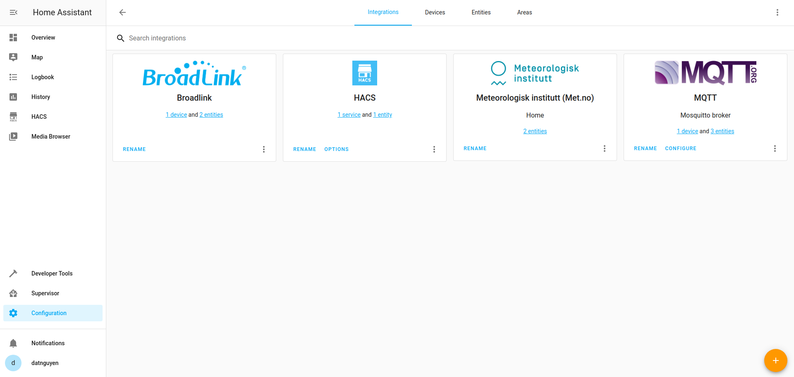
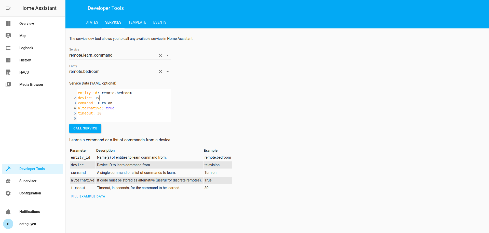
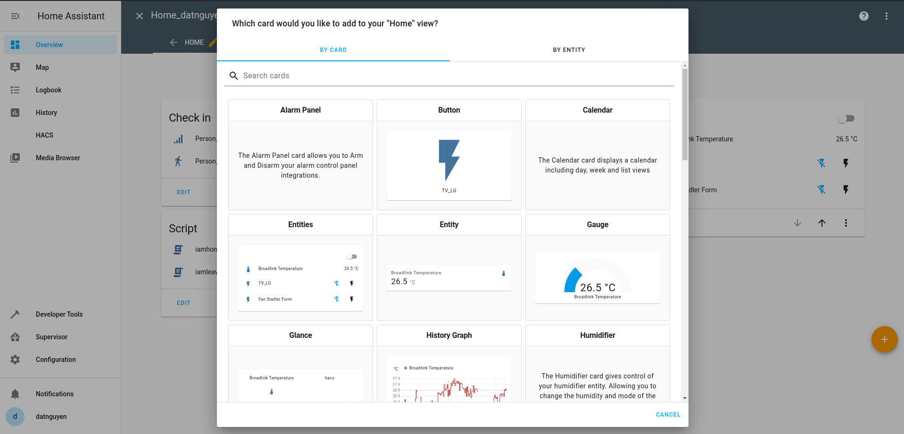

# Kết nối Broadlink RM Pro với Home Assistant

Như đã được giới thiệu trong bài viết [Một số thiết bị SmartHome có sẵn trên thị trường](./Zigbee2MQTT.html), ta đã biết được Broadlink có khả năng học lệnh điều khiển từ các Remote và nó có khả năng tích hợp vào hệ thống SmartHome. Vậy trong bài này, ta sẽ tìm hiểu cách thức kết nối Broadlink với Home Assistant và cách thức học lệnh của nó như thế nào.


Tham khảo kết nối Broadlink với HASS: [link](https://www.home-assistant.io/integrations/broadlink)

Các bước cài đặt:

* Mở file configuration.yaml để bắt đầu thêm component Broadlink

```bash
switch:
  - platform: broadlink
    host: #IP Broadlink
    mac: #MAC Broadlink
    switches:
      name1: # đặt tên cho thiết bị
        friendly_name: "Name device" # tên sử dụng của thiết bị
        command_on:
        command_off:
      name2:
        friendly_name: "Name device" # tên sử dụng của thiết bị
        command_on:
        command_off:
```

Khai báo địa chỉ IP và địa chỉ Mac của thiết bị. Vào modem tìm đến phần các thiết bị đã kết nối với modem để tìm được địa chỉ MAC và địa chỉ IP của Broadlink.


* Click **CHECK CONFIGURATION** và Restart lại HASS


* Sau khi Restart HASS vào **Configuration > Integrations** và Configuration Broadlink



* Vào **Developer Tools > Services** và khai báo như hình bên dưới. VD khai báo cho TV



* Bắt đầu học lệnh: Click **CALL SERVICE**

Sau khi click **CALL SERVICE** trên thiết bị Broadlink sẽ xuất hiện đèn vàng, hướng Remote vào Broadlink và ấn nút bật, tắt. Khi đó đèn vàng sẽ chớp tắt rồi tắt hẳn.


* Khai báo lệnh điều khiển

Vào **config > .storage > broadlink_remote_34ea34e7de30_codes**


Copy 2 dòng lệnh vào command_on/command_off


* Thêm Card Broadlink

Vào **Overview > ⋮ > Edit Dashboard > +** Chọn Card mà bạn muốn thêm.



Đã kết nối và học lệnh. Tiến hành sử dụng.


