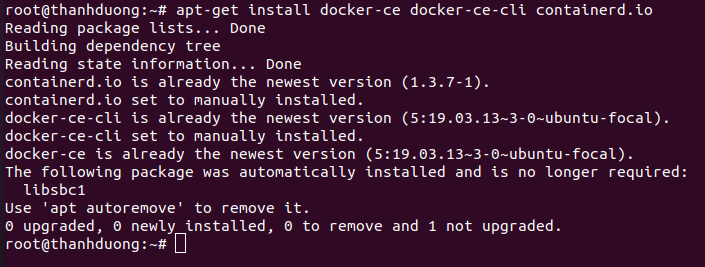

# Cài đặt Home Assistant qua Docker

## Docker là gì?

Docker là một nền tảng mở cung cấp cho người sử dụng những công cụ và service để người sử dụng có thể đóng gói và chạy chương trình của mình trên các môi trường khác nhau một cách nhanh nhất. Bạn có thể giả lập môi trường trên Server ở dưới máy local bình thường hoặc trải nghiệm một hệ điều hành mà không cần dùng đến Virtual Studio.

## Cài đặt Docker

**Bước 1**: Lấy quyền truy cập root access

``` bash
sudo -i
```


**Bước 2**: Cài đặt các packages cần thiết

``` bash
apt-get install \
  apt-transport-https \
  ca-certificates \
  curl \
  gnupg-agent \
  software-properties-common
```


**Bước 3**: Thêm key GPG của Docker

```bash
curl -fsSL https://download.docker.com/linux/ubuntu/gpg | sudo apt-key add -
```


**Bước 4**: Thêm đường link repo mà bạn tải Docker
```
add-apt-repository \
 "deb [arch=amd64] https://download.docker.com/linux/ubuntu \
 $(lsb_release -cs) \
 stable"
```


**Bước 5**: Cài Docker
```bash
apt-get install docker-ce docker-ce-cli containerd.io
```


**Bước 6**: Kiểm tra lại docker đã được cài đúng cách hay chưa
```bash
docker run hello-world
```


## Cài đặt Home Assistant
**Bước 1**: Cài đặt packages cần thiết cho HASS
```bash
apt-get install \
  apparmor-utils \
  avahi-daemon \
  dbus \
  jq \
  network-manager \
  socat
```


**Bước 2**: Cài đặt HASS
```
curl -sL "https://raw.githubusercontent.com/home-assistant/supervised-installer/master/installer.sh" | bash -s
```


**Bước 3**: Dựa vào IP được cho trên terminal ta truy cập vào home assistant bằng chrome hoặc firefox (Trong ví dụ này là 192.168.1.141:8123). Nếu bạn chưa có tài khoản thì HASS sẽ hướng dẫn bạn tạo tài khoản.


