# Multiroom audio (Spotify) sử dụng Raspberry, Snapcast và Mopidy

## Cài đặt Snapcast server và Snapcast client
Tải Snapserver và Snapclient từ [github](https://github.com/badaix/snapcast/releases/latest). Ở đây ta cài đặt cho Raspberry nên sẽ tải các file có định dạng `snapserver_<version>_armhf.deb` và `snapclient_<version>_armhf.deb`.

```bash
sudo wget <download_link_snapserver hoặc download_link_snapclient>
```
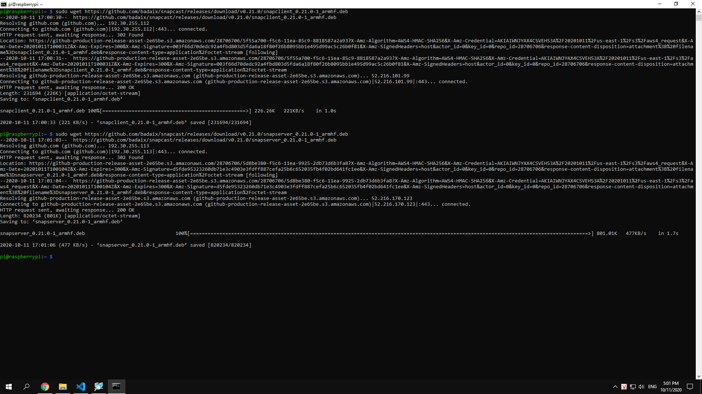

### Cài đặt Snapserver
* **Bước 1**: Cài đặt Snapserver

```bash
sudo dpkg -i snapserver_<version>_armhf.deb
```


* **Bước 2**: Chạy Snapserver.

```bash
snapserver
```

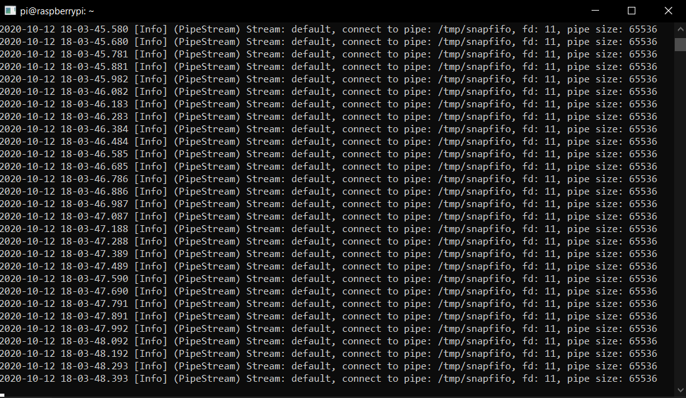

* **Bước 3**: Hiển thị IU của Snapserver ở local.
Địa chỉ mặc định của Snapserver là `0.0.0.0:1780`.

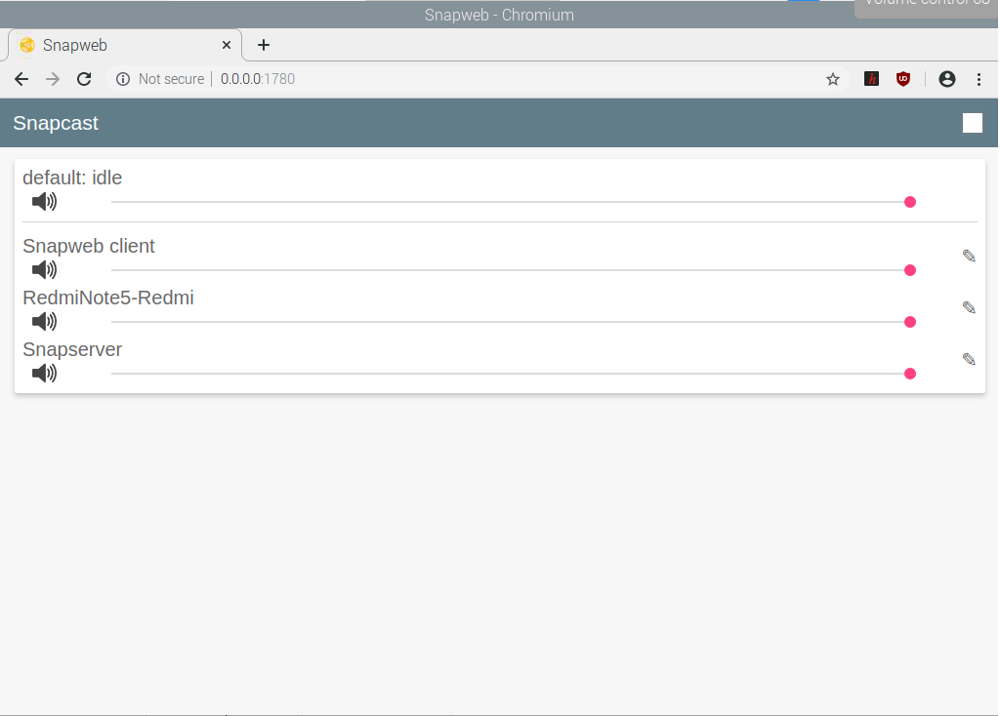

Hoặc có thể xem địa chỉ của Snapserver bằng cách xem log.

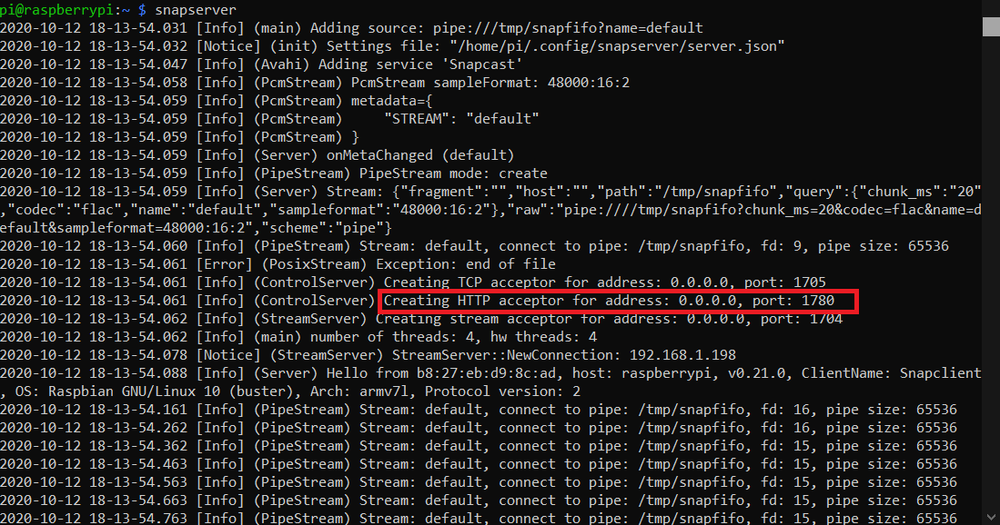

### Cài đặt Snapclient (Không bắt buộc)
Snapclient chỉ cần thiết nếu ta muốn dùng Raspberry như một client có thể phát nhạc, nếu không ta có thể dùng app [Snapcast](https://play.google.com/store/apps/details?id=de.badaix.snapcast) có sẵn trong CH Play.

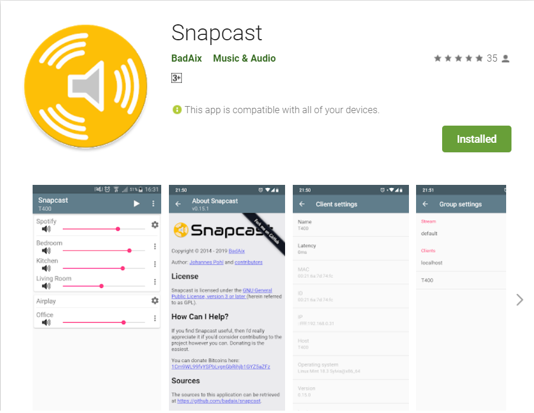

* **Bước 1**: Cài đặt Snapclient

```bash
sudo dpkg -i snapclient_<version>_armhf.deb
```

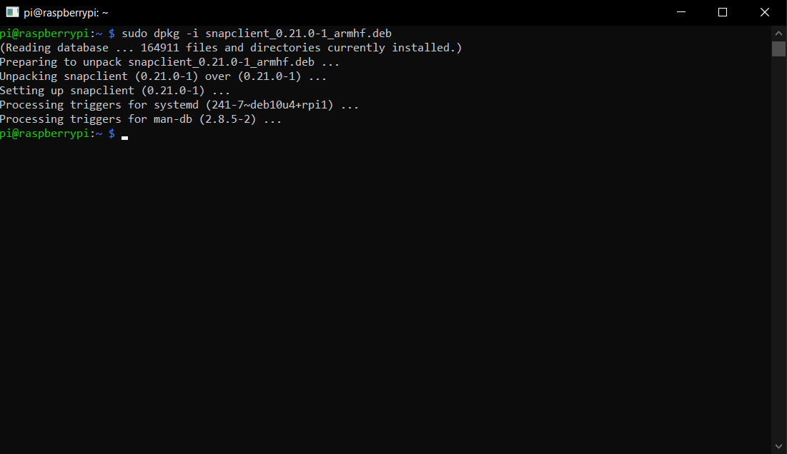

* **Bước 2**: Chạy Snapclient.

```bash
snapclient
```

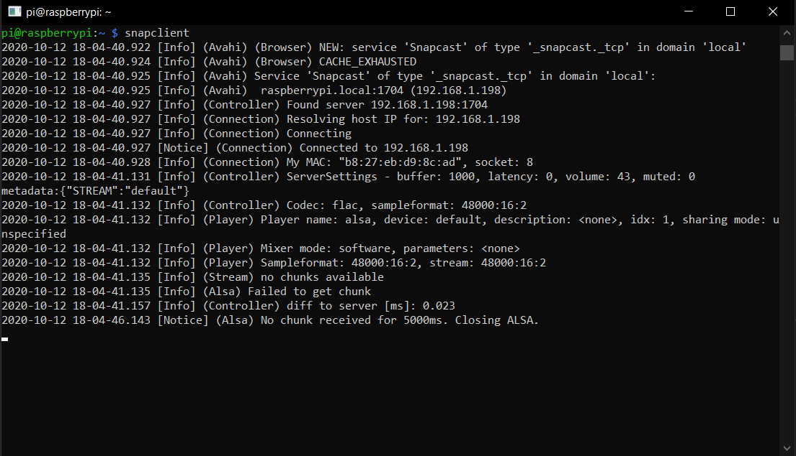

## Cài đặt Mopidy, các extension cần thiết

* Cài đặt [Mopidy](https://docs.mopidy.com/en/release-0.19/installation/debian/).

```bash
wget -q -O - https://apt.mopidy.com/mopidy.gpg | sudo apt-key add -
sudo wget -q -O /etc/apt/sources.list.d/mopidy.list https://apt.mopidy.com/buster.list
sudo apt update
sudo apt install mopidy
```

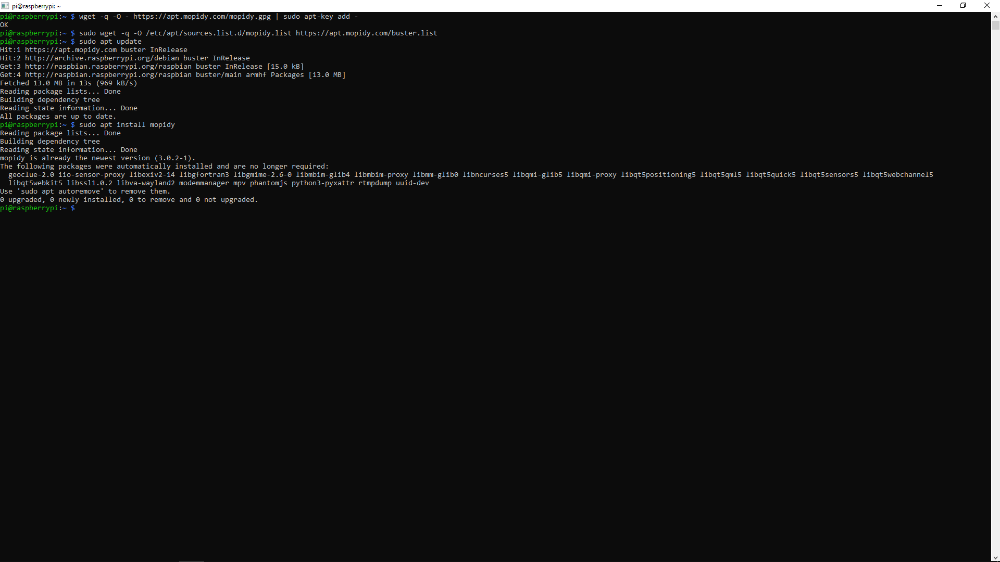

* Cài đặt extension [Mopidy-Spotify](https://github.com/mopidy/mopidy-spotify).

```bash
sudo python3 -m pip install Mopidy-Spotify
```

* Cài đặt web extension [Mopidy-Mopify](https://github.com/dirkgroenen/mopidy-mopify).

```bash
sudo python3 -m pip install mopidy-mopify
```

## Chỉnh sửa file cấu hình của Mopidy
File cấu hình của Mopidy `mopidy.conf` nằm tại đường dẫn `~/.config/mopidy`. Để mở file, ta dùng lệnh:

```bash
sudo nano ~/.config/mopidy/mopidy.conf
```

* Ở phần `[audio]` ta thêm giá trị:

```
output = audioresample ! audioconvert ! audio/x-raw,rate=48000,channels=2,format=S16LE ! filesink location=/tmp/snapfifo
```

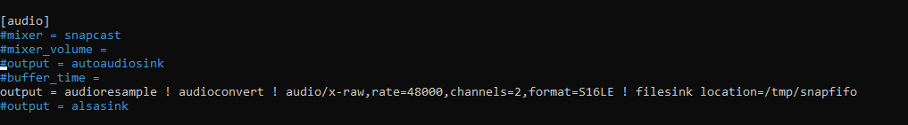

* Có thể chỉnh sửa lại giá trị `hostname` trong phần `[Http]` thành `localhost` hoặc `127.0.0.1` hoặc `IP của Rapberry` (không bắt buộc).

Sau khi đã cài đặt các extension ở phần trên, ta cần khai báo extension đó cùng các giá trị của nó trong file cấu hình mopidy.
* Mopidy-Spotify:

 ```
 [spotify]
 username =
 password =
 client_id =
 client_secret =
 ```

 * `username`: có thể tìm thấy trong phần `Tổng quan về tài khoản` trong Spotify

 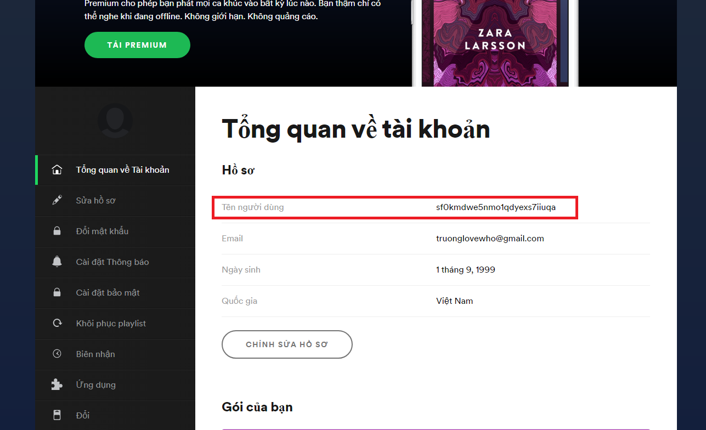

 * `password`: mật khẩu đăng nhập vào Spotify.

 * `client_id` và `client_secret`: Vào [https://mopidy.com/ext/spotify/](https://mopidy.com/ext/spotify/) và nhấn vào `Authenticate Mopidy with Spotify`. Sau khi đăng nhập vào Spotify cá nhân, `client_id` và `client_secret` sẽ được tạo ra.

 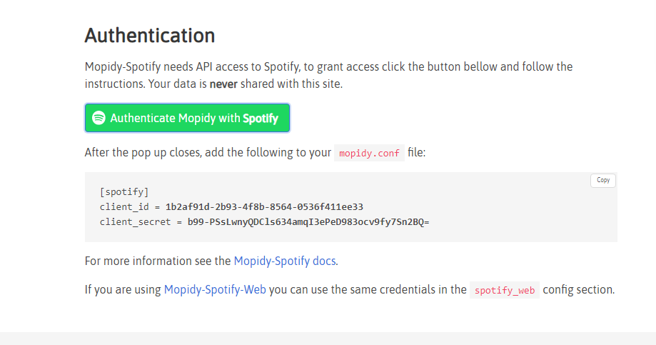

 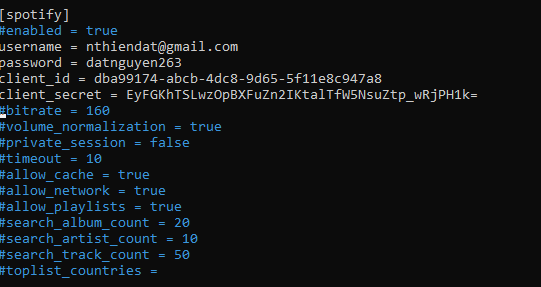

* Mopidy-Mopify:

```
[mopify]
enabled = true
debug = false
```

## Chạy Mopidy và thiết lập Mopify để phát nhạc

### Chạy Mopidy và truy cập Mopify
* Khởi động Mopidy.

```bash
mopidy
```

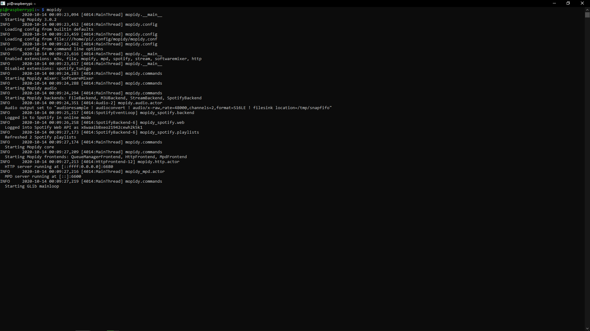

* Truy cập vào Mopify: địa chỉ truy cập của mopify tùy vào giá trị `hostname` và `port` tại phần `[Http]` của file cấu hình Mopidy.

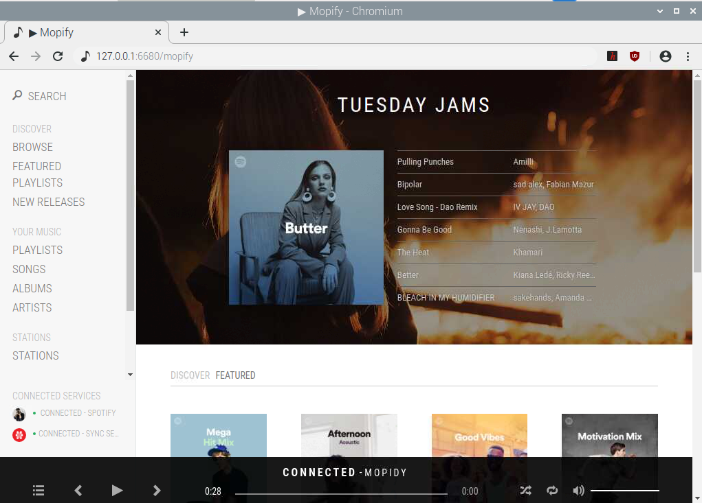

### Thiết lập Mopify để phát nhạc
Trong mục Service, chọn kết nối Spotify và đăng nhập tài khoản Spotify giống với tài khoản đã khai báo trong file cấu hình của Mopidy. Sau khi kết nối, các thông tin trên Spotify đã được đồng bộ với Mopify và có thể bắt đầu phát nhạc bằng Mopify.

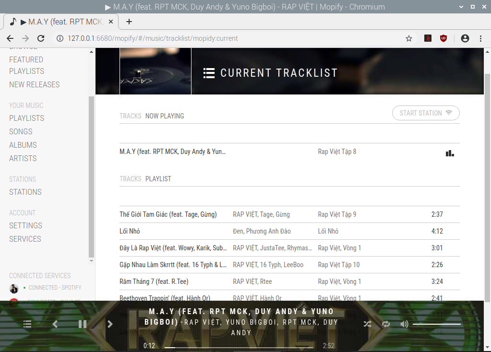

## Các lỗi thường gặp và cách giải quyết
1. **dpkg frontend is locked by another process**: lỗi có thể gặp phải khi cài đặt Snapserver và Snapclient bằng `dpkg`.

 **Các giải quyết**:

 * **Bước 1**: Tìm PID của tiến trình đang giữ file lock.

 ```bash
 lsof /var/lib/dpkg/lock-frontend
 ```

 * **Bước 2**: Tiến hành `kill` tiến trình đó bằng PID tìm được.

 ```bash
 sudo kill -9 <PID>
 ```

 * **Bước 3**: Xóa file lock và cấu hình lại `dpkg`.

 ```bash
 sudo rm /var/lib/dpkg/lock-frontend
 sudo dpkg --configure -a
 ```

2. Không thể phát nhạc bằng Mopify hoặc các bài hát chỉ nằm ở `Queue` và `Playlist` dù đã nhấn `Play`.

 **Cách giả quyết**:
 Hãy chắc chắn rằng tài khoản Spotify được khai báo trong file cấu hình Mopidy và tài khoản được kết nối vào Mopify đều giống nhau và là tài khoản Premium.

3. Nhạc ở các Snapclient được phát quá nhanh và có nhiều tạp âm.

 **Cách giải quyết**:
 Không được chạy Snapserver bằng cả hai cách là dùng lệnh:

 ```bash
 snapserver
 ```
 Và sử dụng service snapserver.service cùng một lúc với nhau mà chỉ được chọn một trong hai.

4. Khi chạy Mopidy bằng cách chạy `mopidy.service` thì bị bị báo lỗi thiếu các phần cấu hình dù đã cấu hình trước đó.

 **Cách giải quyết**:
 `mopidy.service` sử dụng file cấu hình nằm ở đường dẫn `/etc/mopidy/mopidy.conf` còn khi chạy Mopidy bằng lệnh `mopidy` file cấu hình được dùng nằm ở `~/.config/mopidy/mopidy.conf`.

## Quản lý Multiroom Audio bằng HASS

### Cài đặt Hass trên Docker

#### Cài đặt Docker
* **Bước 1**: Cài đặt Docker.

```bash
sudo apt-get update && sudo apt-get upgrade
curl -fsSL https://get.docker.com -o get-docker.sh
sudo sh get-docker.sh
```

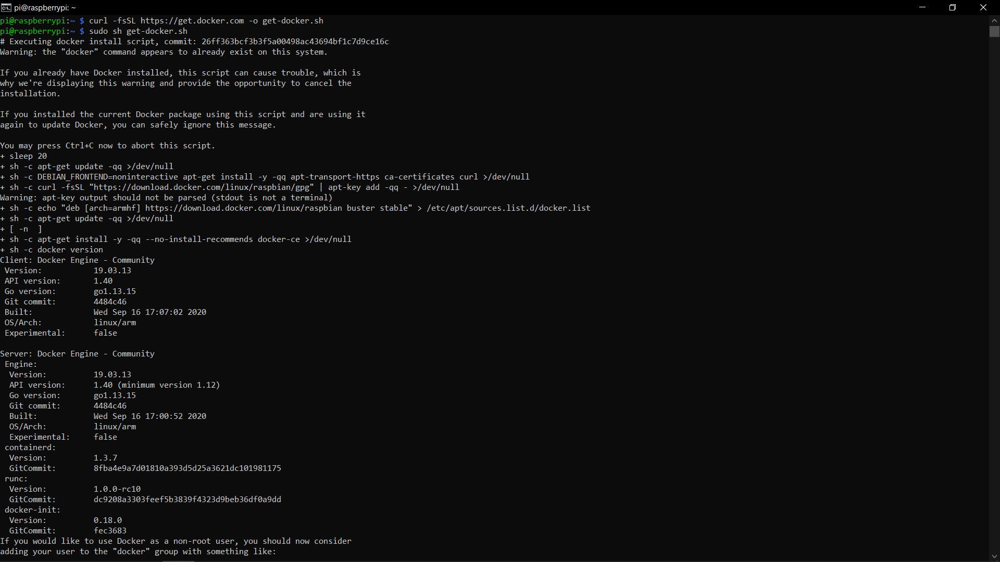

* **Bước 2**: Thêm non-root User vào group Docker (không bắt buộc).
Mặc định của Docker là chỉ các root user mới có thể khởi chạy các container. Nếu không sử dụng root user thì khi khởi chạy các container phải dùng `sudo`. Việc thêm các non-root user vào group Docker giúp ta chạy cách lệnh của Docker mà không phải làm các việc trên.

```bash
sudo usermod -aG docker <user_name>
```
Ví dụ, nếu muốn thêm user `pi` vào group Docker:

```bash
sudo usermod -aG docker pi
```
Sau bước này ta tiến hành reboot lại trước khi tiếp tục.

```bash
sudo reboot
```

* **Bước 3**: Cài đặt Docker Compose (không bắt buộc).
Docker Compose dùng để định nghĩa và chạy multi-container.

```bash
sudo pip3 -v install docker-compose
```

* **Bước 4**: Kiểm tra các thông tin và phiên bản Docker đã cài đặt.

```bash
docker info
```

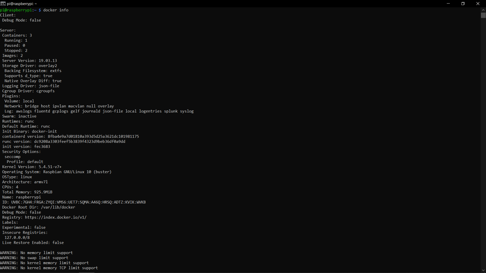

```bash
docker version
```


* **Bước 5**: Chạy container mẫu `Hello World` để kiểm tra xem Docker có bị lỗi trong quá trình thiết lập hay không.

```bash
docker run hello-world
```

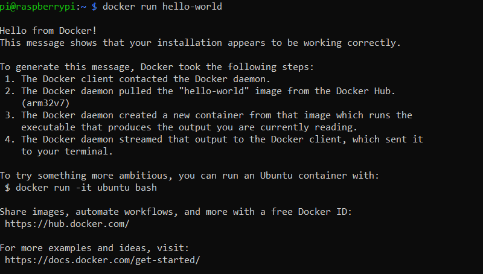

#### Cài đặt HASS trên Docker

* **Bước 1**: Cài đặt HASS.

```bash
docker run --init -d --name="home-assistant" -e "TZ=<YOUR_TIME_ZONE>" -v <CONFIG_LOCATION>:/config --net=host homeassistant/raspberrypi3-homeassistant:stable
```


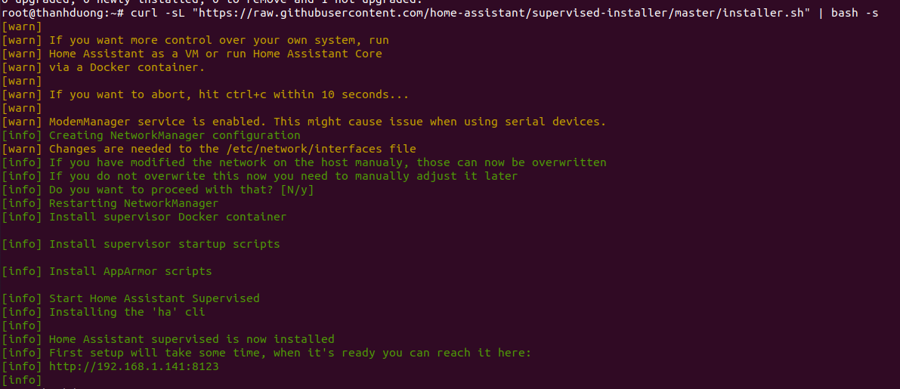

`TZ` (Time Zone) có thể được tìm thấy bằng lệnh:

```bash
timedatectl list-timezones
```
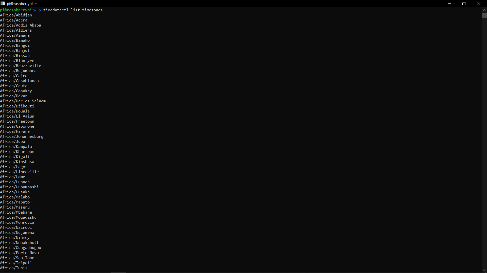

* **Bước 2**: Kiểm tra thông tin của HASS.

```bash
docker ps -a
```

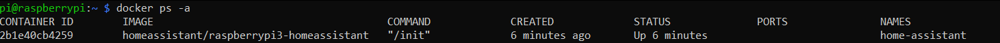

* **Bước 3**: Sử dụng trình duyệt để hiện thị HASS.
Truy cập địa chỉ `<IP_Raspberry_contains_HASS>:8123` bằng trình duyệt để sử dụng HASS.

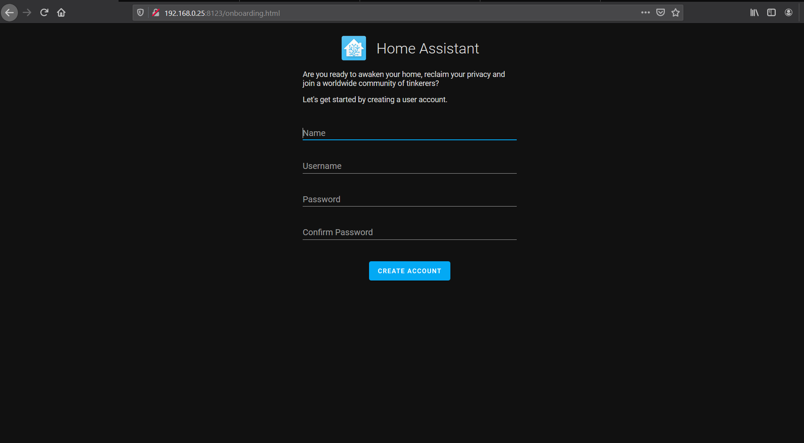

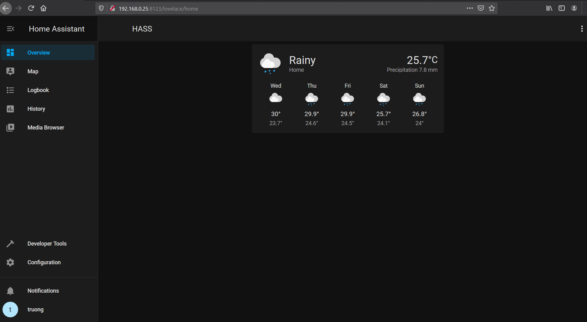

### Thêm Multiroom Audio vào HASS
* **Bước 1**: Vào thư mục chứa file cấu hình `configuration.yaml`, chỉnh sửa và thêm cấu hình của Snapcast.

```
media_player:
 - platform: snapcast
   host: <ip_of_snapserver>
```

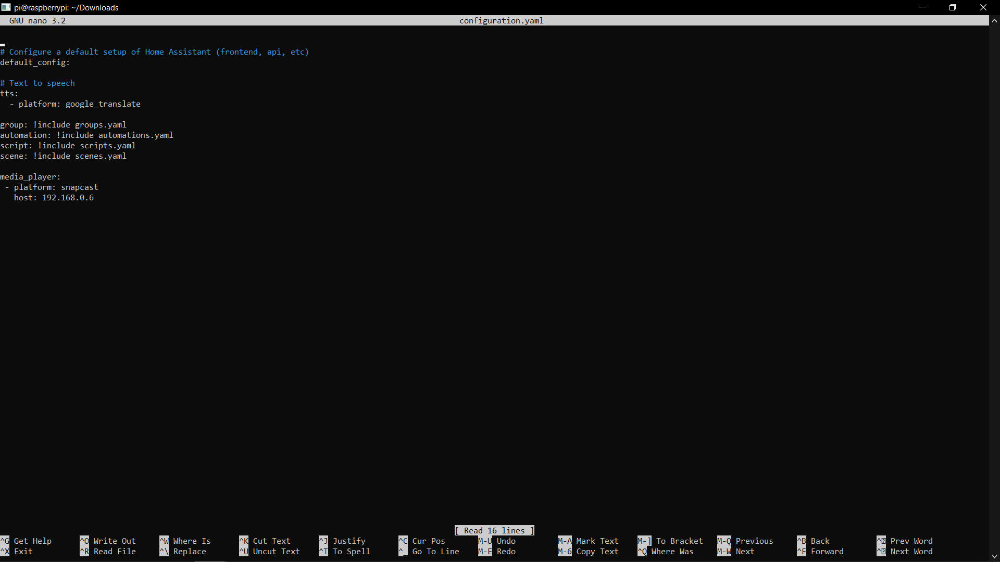

* **Bước 2**: Thêm script để định nghĩa và hiển thị các client.
Chọn `Edit Dashboard -> Raw configuration editor`

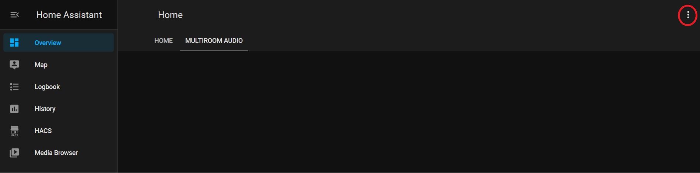

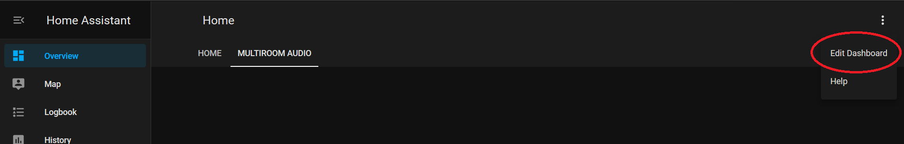

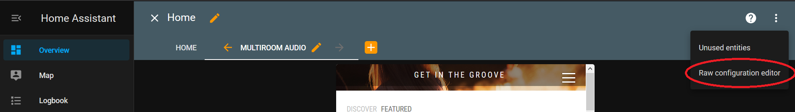

```
- type: media-control
  entity: <id_of_snapclient>
  name: <optional_name_for_entity>
```

Nhấn `SAVE` để lưu lại.

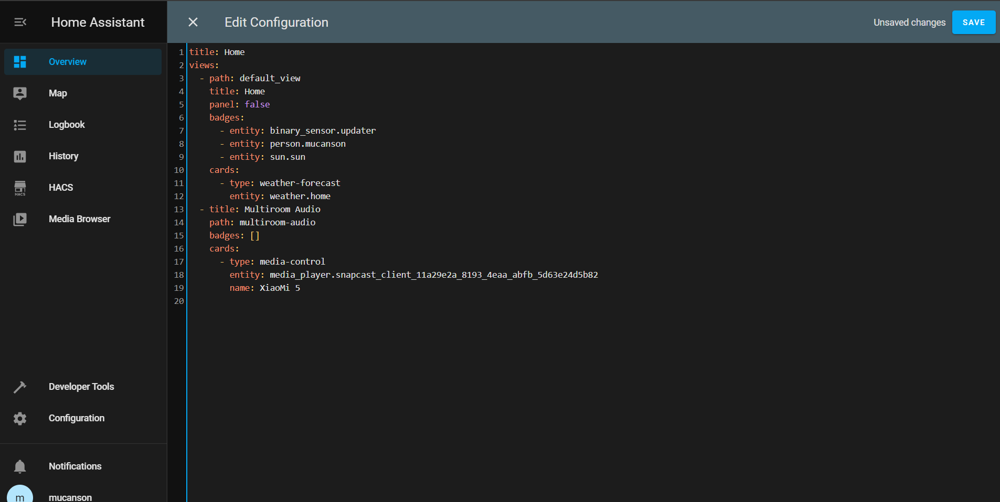

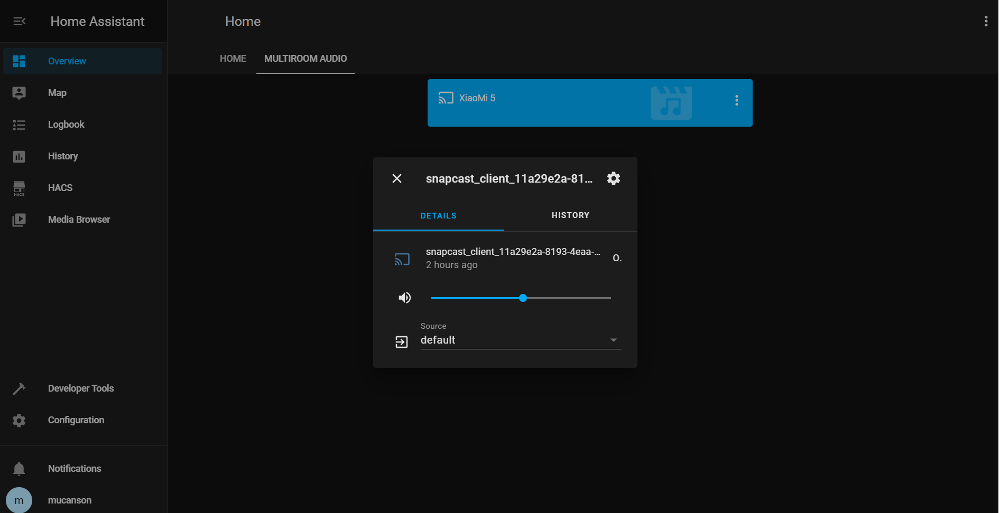

* **Bước 3**: Thêm script định nghĩa và hiển thị giao diện của mopify để điều khiển việc phát nhạc.
Chọn `Edit Dashboard -> Raw configuration editor`

```
- type: iframe
  url: 'http://<IP_of_mopidy>:<port_of_mopidy>/mopify'
  aspect_ratio: <optional_aspect_ratio>
  title: <optional_title>
```

Nhấn `SAVE` để lưu lại.

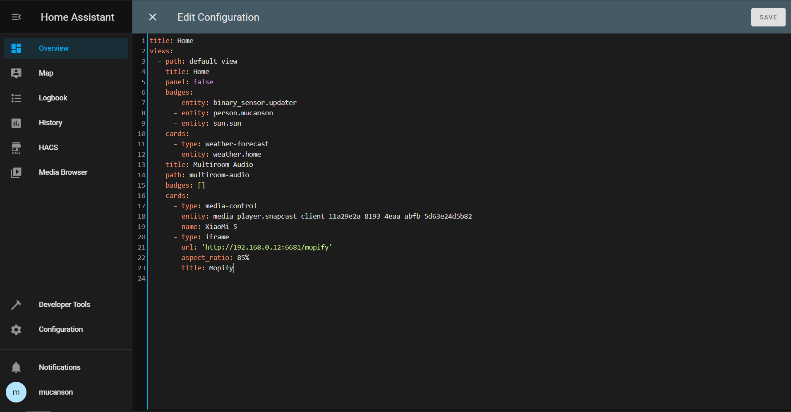

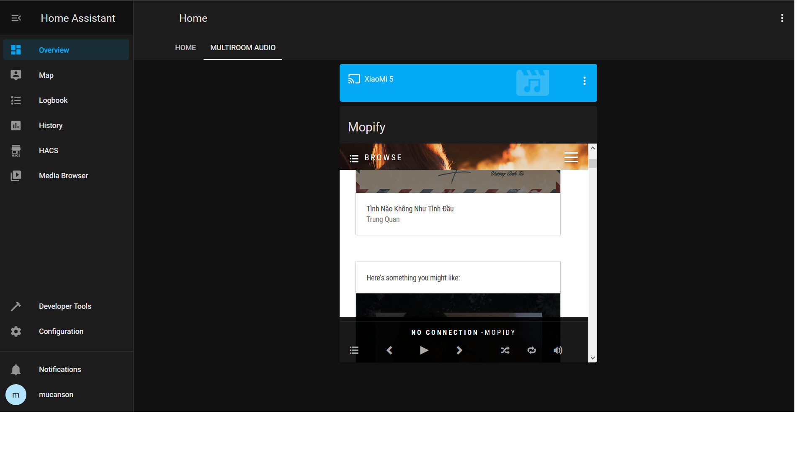
