# Cài đặt Raspbian cho Raspberry Pi trên Ubuntu

## Một số hệ điều hành phổ biến cho Raspberry PI

Raspberry PI là một máy tính nhúng thông dụng và được phát triển từ năm 2012, vì thế cho đến nay nó được hỗ trợ khá nhiều hệ điều hành, trong đó có Raspbian là hệ điều hành chính thức của Raspberry PI.

* Raspbian: https://www.raspberrypi.org/downloads
* Ubuntu Mate: https://ubuntu-mate.org/raspberry-pi
* Snappy Core Ubuntu: https://www.unixmen.com/snappy-ubuntu-core-an-entirely-new-ubuntu-operating-system-for-clouds-and-devices
* Windows 10 IoT Core: https://www.microsoft.com/en-us/software-download/windows10IoTCore
* OSMC: https://osmc.tv/download
* OpenELEC: http://openelec.tv/get-openelec
* PiNet: http://pinet.org.uk/
* RiscOS: https://www.riscosopen.org/content/downloads/raspberry-pi

## Cài đặt Raspbian trên Ubuntu

### Cài đặt Imager

* Để cài đặt hệ điều hành Raspbian cho Raspberry PI, đầu tiên ta cần phải download [Imager](https://www.raspberrypi.org/downloads) từ trang chủ của Raspberry PI.
* Click **Raspberry Pi Imager for Ubuntu** để tải **imager_1.4_amd64.deb**
* Để cài đặt **Imager**, Double Click lên file đã tải, **Nhập password** và chờ cài đặt.
* Sau khi cài đặt, khởi động Imager.

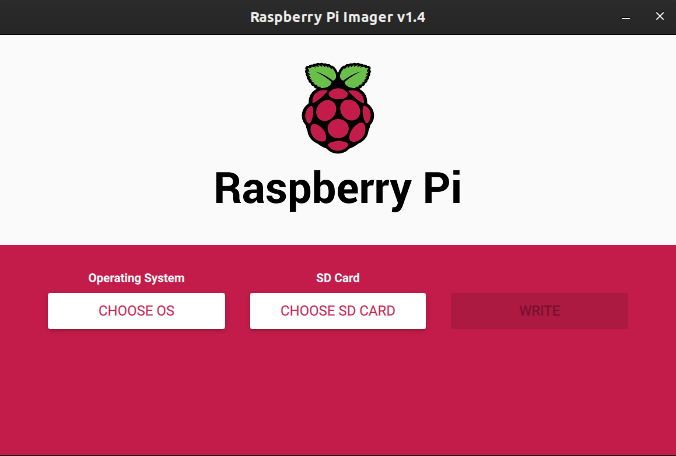

* Chọn **CHOOOSE OS** để lựa chọn OS cần cài đặt lên PI.
    * Chọn Raspbian Pi OS (other) - Raspbian Pi OS Full (32-bit).
* Chọn **CHOOSE SD CARD** để lựa chọn thẻ nhớ cần cài đặt.
* Sau khi hoàn thành các bước trên ta sẽ có giao diện tương tự như sau.

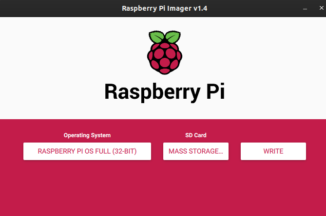

* Click **Write** để tiến hành cài đặt. Click **yes** để đồng ý.
* Chờ một lúc để quá trình cài đặt hoàn tất.

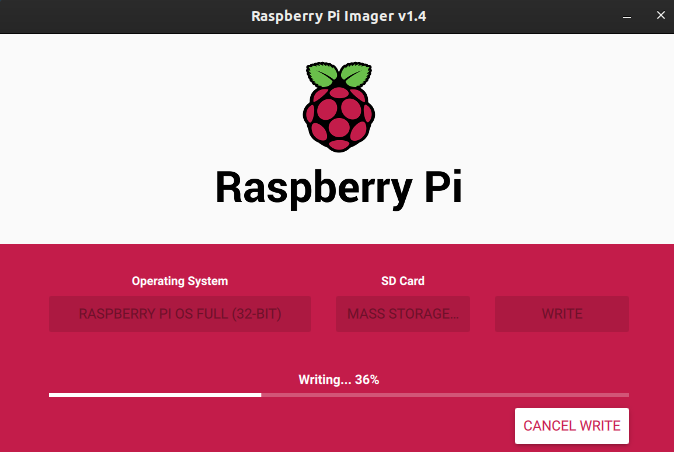

* Hoàn thành bước cài đặt Raspbian

Lưu ý: Có thể tham khảo thêm ở [đây](https://www.raspberrypi.org/documentation/installation/installing-images/linux.md) nếu quá trình cài đặt có lỗi xảy ra.

### Setup cơ bản Raspbian - Khi có đầy đủ thiết bị

* Gắn thẻ nhớ, kết nối Raspberry Pi với màn hình, bàn phím, chuột và cắm nguồn. Sau khi khởi động thì cửa sổ xuất hiện:

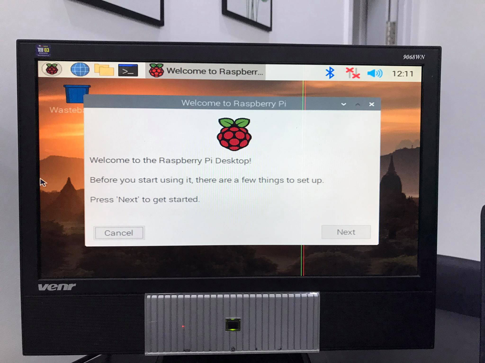

* Click **Next**. Thiết lập vị trí, ngôn ngữ, thời gian

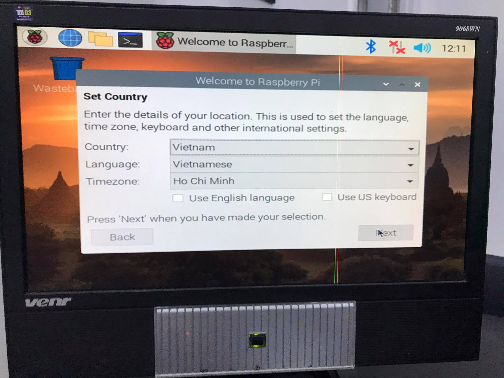

* Click **Next**. Thiết lập kết nối wifi

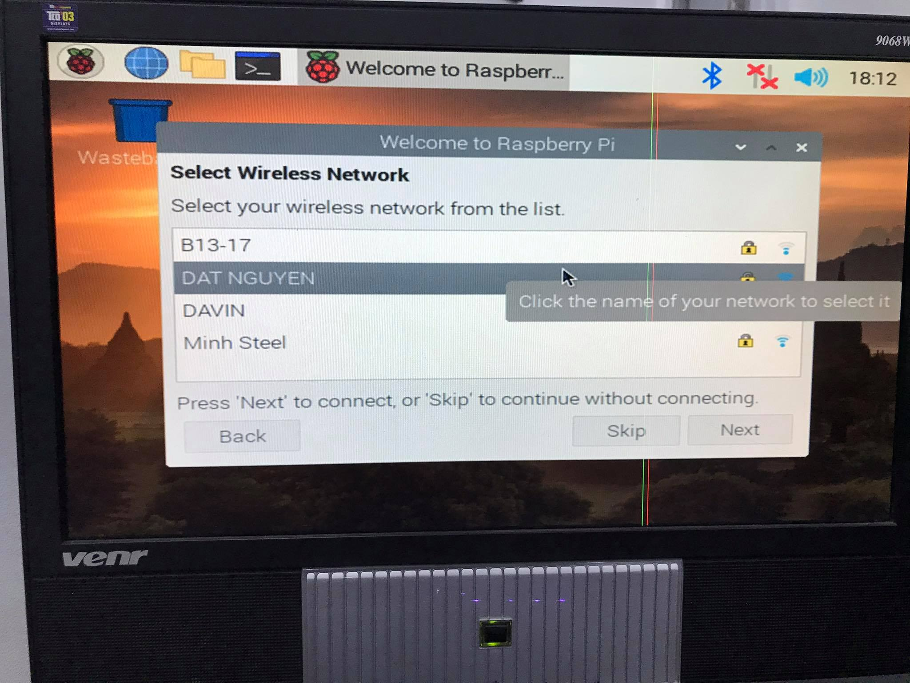

* Click **Next**. Cập nhật hệ điều hành

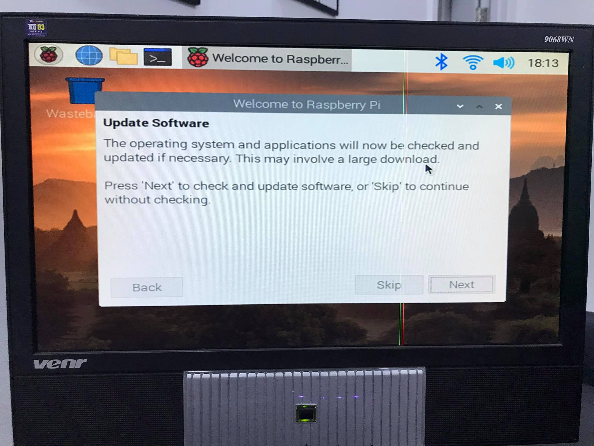

* Click **Next**. Chờ cho quá trình cập nhật diễn ra

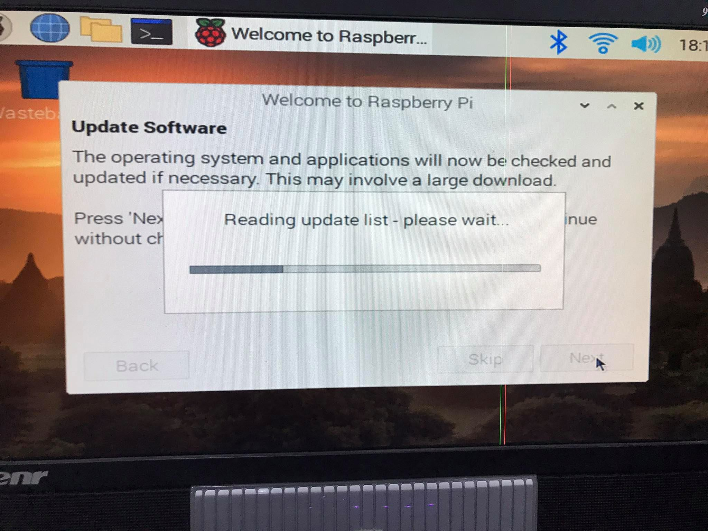

* Sau khi quá trình cập nhật hoàn thành, click **Restart** để khởi động lại thiết bị.
* Sau khi khởi động lại, việc thiết lập ban đầu hoàn tất.

### Setup cơ bản Raspbian - Không có đầy đủ thiết bị

#### Setup wifi khi không có màn hình

**Cắm thẻ nhớ vào máy tính cá nhân**

* Vào **boot**, tạo file **wpa_supplicant.conf**

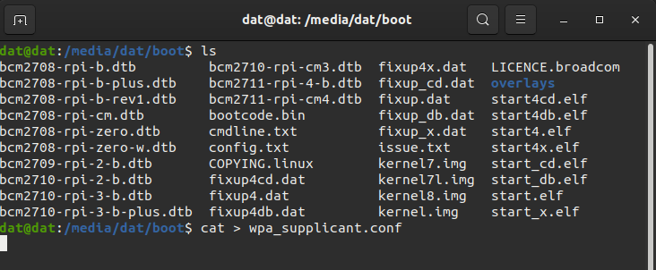

* Thêm các dòng lệnh.

```bash
ctrl_interface=DIR=/var/run/wpa_supplicant GROUP=netdev
update_config=1
country=VN
network={
ssid="YOUR_NETWORK_NAME"
psk="YOUR_PASSWORD"
key_mgmt=WPA2-PSK
}

```
Trong đó:
* **YOUR_NETWORK_NAME** là tên mạng WiFi.
* **YOUR_PASSWORD** là mật khẩu WiFi nếu có.

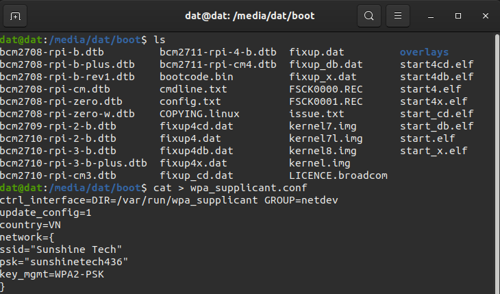

Tháo thẻ nhớ ra cắm vào Raspberry PI và khởi động. Lúc này Raspbian sẽ tự detect folder /boot. Nếu file **wpa_supplicant.conf** có tồn tại thì nó sẽ được copy vào đúng nơi lưu trữ cấu hình WiFi và kết nối với WiFi mới.

#### SSH

Để thực hiện SSH tới Raspberry, trước hết máy tính cần phải được kết nối chung mạng với Raspberry PI, sau đó phải tìm được tìm được địa chỉ IP cần kết nối. Ubuntu có hỗ trợ một phần mềm tìm địa chỉ IP là nmap.

* Cài đặt nmap

```bash
$ sudo apt-get install nmap
```

* Tìm địa chỉ IP của máy tính Ubuntu

```bash
$ ifconfig
```

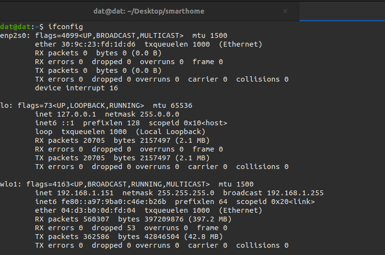

* Tìm địa chỉ IP của Raspberry PI

Vì Raspberry PI được kết nối chung mạng với máy tính nên ta có thể dùng địa chỉ lớp mạng của máy tính để tìm. Địa chỉ của máy tính hiện tại là **192.168.1.151** như vậy ta cần tìm IP trên lớp mạng **192.168.1.0/24**.

```bash
$ nmap -sn 192.168.1.0/24
```
Địa chỉ IP của Raspberry

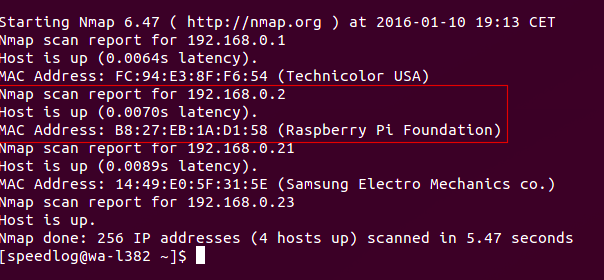

**Ngoài ra cũng có thể sử dụng phần mềm FING trên Smartphone để tìm địa chỉ IP (chỉ cần Smartphome sử dụng cùng mạng với thiết bị).**

* SSH

```bash
$ ssh pi@<ip của Raspberry>
```

Nhập password là: raspberry

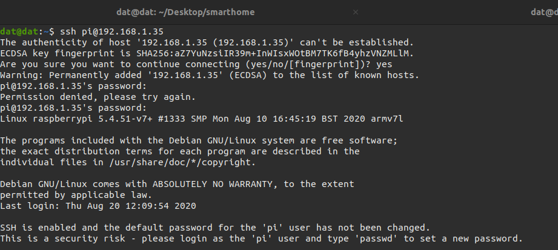

Như vậy ta đã hoàn tất việc cài đặt Raspbian trên Ubuntu và có thể truy cập tới Raspberry PI qua SSH.
