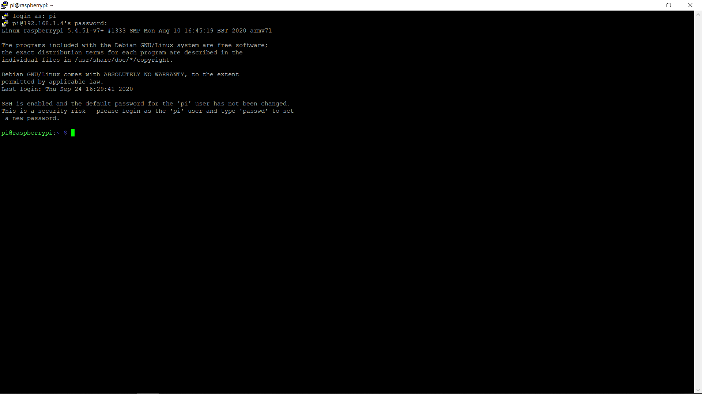

# Cài đặt Raspbian cho Raspberry Pi trên Windows

## Sử dụng Raspberry Pi Imager để cài đặt Raspbian
* **Bước 1**: Tải phần mềm [Raspberry Pi Imager](https://downloads.raspberrypi.org/imager/imager_1.4.exe) và tiến hành cài đặt phần mềm.


* **Bước 2**: Sử dụng đầu đọc thẻ MicroSD để kết nối thẻ vào máy tính và kiểm tra lại ổ đĩa chứa dữ liệu của thẻ.

* **Bước 3**: Mở **Raspberry Pi Imager**, chọn OS có sẵn trong phần mềm.


Hoặc OS đã tải về trong máy.


* **Bước 4**: Chọn thẻ MicroSD cần ghi và nhấn Write để bắt đầu ghi OS vào thẻ.


Sau khi quá trình Write hoàn thành, ngắt kết nối thẻ MicroSD khỏi máy tính, cắm vào Raspberry. Sau đó, có thể cấp nguồn, khởi động và tiến hành các bước cấu hình cho Raspberry (nếu có màn hình để kết nối).


## Cách bật SSH và cấu hình Wifi cho Raspberry (headless Raspberry)

### Cách bật SSH cho Raspberry (headless Raspberry)

* **Bước 1**: Ngắt nguồn (nếu Raspberry đang hoạt động) và lấy thẻ MicroSD khỏi Raspberry.

* **Bước 2**: Dùng đầu đọc MircoSD để kết nối thẻ nhớ vào máy tính.

* **Bước 3**: Đi đến ổ đĩa chứa dữ liệu thẻ MicroSD và tạo một file rỗng, không có phần phần mở rộng (extension) và đặt tên là `ssh`.


Nếu file bị ẩn phần mở rộng, nhấn vào View trong File Explorer và chọn vào *File name extensions*.


* **Bước 4**: Ngắt kết nối thẻ MicroSD khỏi máy tính và gắn vào Raspberry.

* **Bước 5**: Cấp nguồn và khởi động Raspberry. Sau đó, ta có thể SSH được vào Rasberry.

### Cách cấu hình Wifi cho Raspberry (headless Raspberry)

* **Bước 1**: Ngắt nguồn và lấy thẻ MicroSD khỏi Raspberry.

* **Bước 2**: Dùng đầu đọc MircoSD để kết nối thẻ nhớ vào máy tính.

* **Bước 3**: Đi đến ổ đĩa chứa dữ liệu thẻ MicroSD và tạo một file tên là `wpa_supplicant.conf` và thêm các dòng lệnh sau vào và lưu lại.

```bash
ctrl_interface=DIR=/var/run/wpa_supplicant GROUP=netdev
update_config=1
country=<Insert 2 letter ISO 3166-1 country code here>

network={
 ssid="NETWORK-NAME"
 psk="NETWORK-PASSWORD"
}
```


* **Bước 4**: Ngắt kết nối thẻ MicroSD khỏi máy tính và cắm vào Raspberry.

* **Bước 5**: Khởi động Raspberry. Dùng [Advanced IP Scanner](https://www.advanced-ip-scanner.com/download/Advanced_IP_Scanner_2.5.3850.exe) hoặc các phần mềm tương tự để tìm được IP của Raspberry, sau đó ta có thể tiến hành ssh vào Raspberry vào tiến hành các bước cấu hình khác cho Raspberry.


Có thể chọn SSH bằng Putty hoặc Command line của máy tính
 - Putty:
  - Cài đặt (Putty)[https://www.chiark.greenend.org.uk/~sgtatham/putty/latest.html].
  - Mở Putty và nhập IP của Raspberry đã có được khi dùng Advanced IP Scanner.

  

  - Nhập `username` và `password` của để đăng nhập vào Raspberry, `username` và `password` mặc định của Raspberry lần lượt là `pi` và `raspberry`.

  
 - Command line:
  - Mở Command line trên máy tính và dùng lệnh:

  ```bash
   ssh <username_of_pi>@<IP_of_pi>
  ```
   `username` mặc định của Raspberry là `pi`.

  

  - Nhập `password` của pi, `password` mặc định là `raspberry`

  
