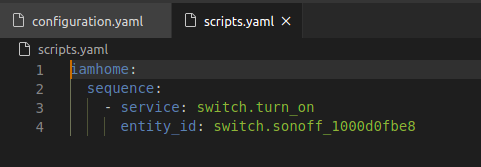
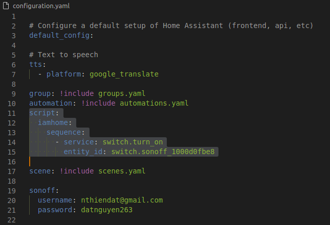
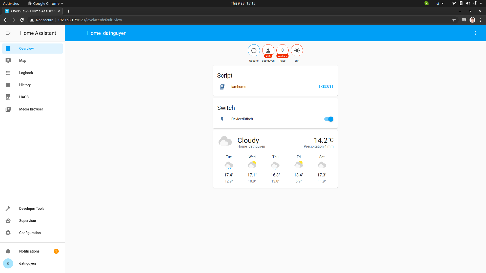

# Script trong Home Assistant
**Script trong HASS là gì?**

Hiểu theo một cách đơn giản thì Script cho phép thiết lập một chuỗi hành động liên tiếp nhau có thứ tự.

**Tại sao lại cần đến Script trong Hass?**

Vì Script sẽ thực hiện một chuỗi các hành động liên tiếp nhau, ví dụ khi về nhà thay vì thực hiện các hành động rời rạc như bật tất cả các đèn, mở máy lạnh, điều chỉnh nhiệt độ... thì một việc đơn giản hơn có thể thực hiện là xây dựng một đoạn Script để thực hiện tất cả những hành động trên chỉ với một thao tác duy nhất.

## Cấu trúc Script trong HASS

Ví dụ về Script:

```bash
script:
  iamhome:
    sequence:
      # gọi service mở đèn và mở máy lạnh
      - service: switch.turn_on
        entity_id:
          - switch.main_light_1
          - switch.air_con
       # gọi service tắt switch báo động
      - service: switch.turn_off
        entity_id: switch.alarm
```

Cấu trúc Script gồm có:

* **script:** Khai báo script.
* **iamhome:** Tên của script.
* **sequence:** Là câu khai báo của script.
* **service:** Khai báo thiết bị và sự kiện của thiết bị đó.
* **entity_id:** Chỉ ra cụ thể thiết bị nào.

**Lưu ý:** Phải đảm bảo đúng cú pháp (khoảng trắng " " và gạch nối "-")

## Các cách để viết script

**script** điều khiển thiết bị sonoff

**Cách 1:** Viết vào file config/scripts.yaml



**Cách 2:** Viết vào file config/configuration.yaml



Sau khi viết **scripts** **Check configuration** và **reload script**



Click **EXECUTE** để test Scripts

**Tương tự viết script tắt sonoff**
