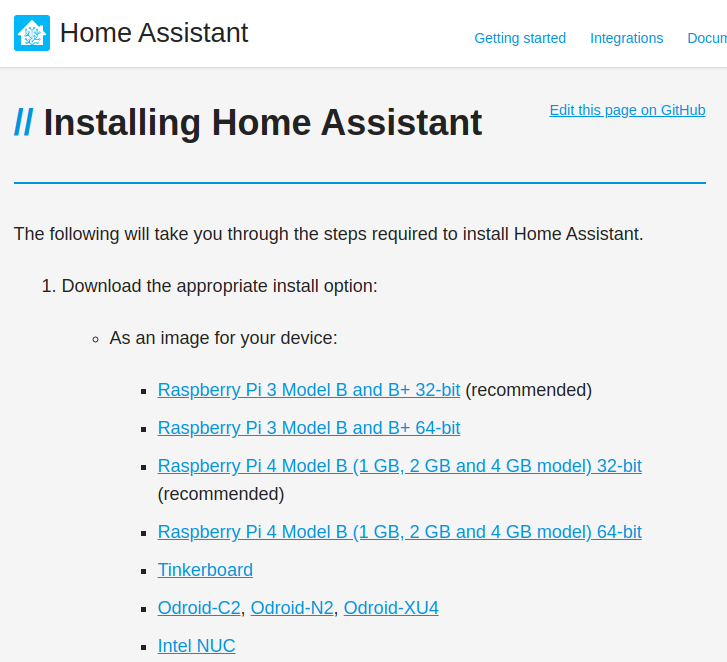
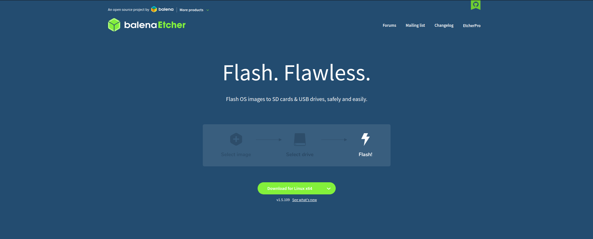
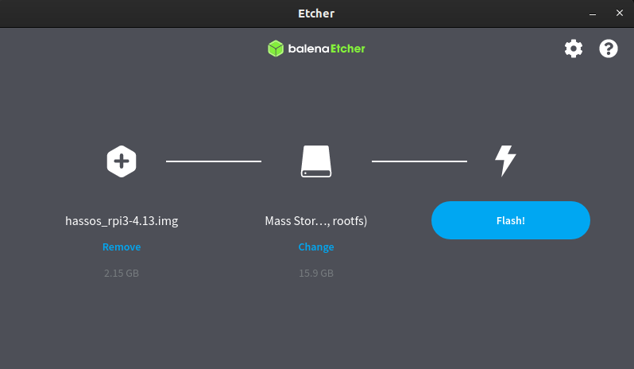
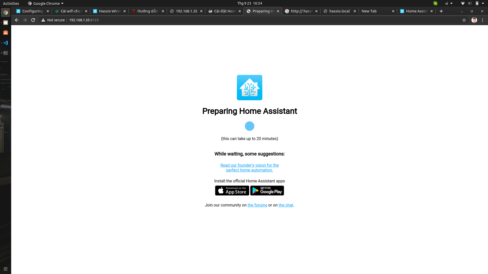
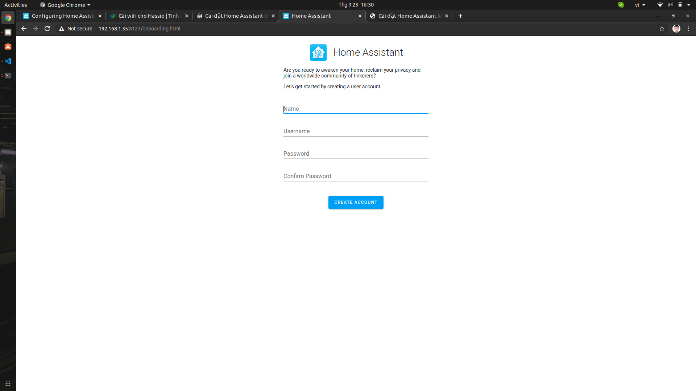
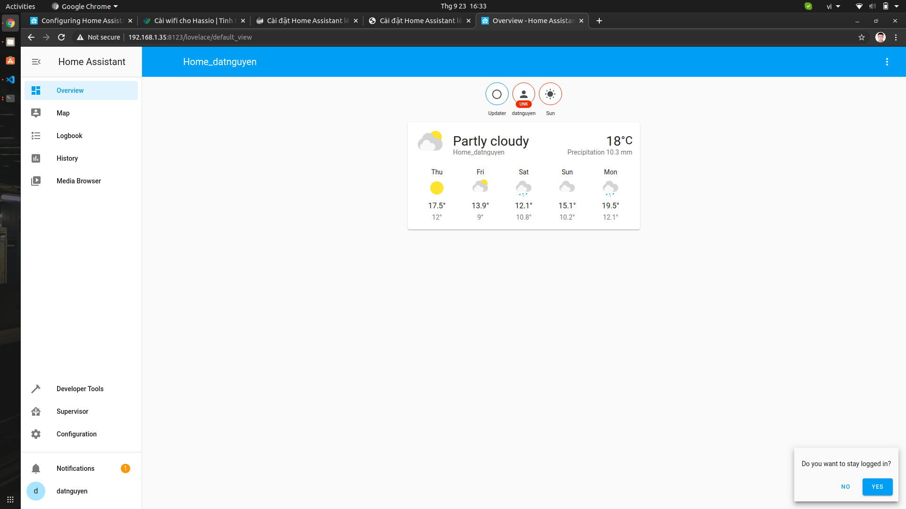
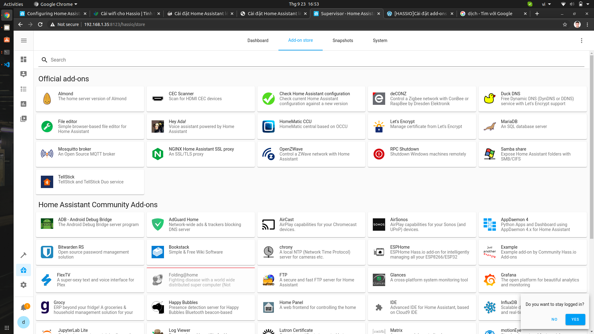
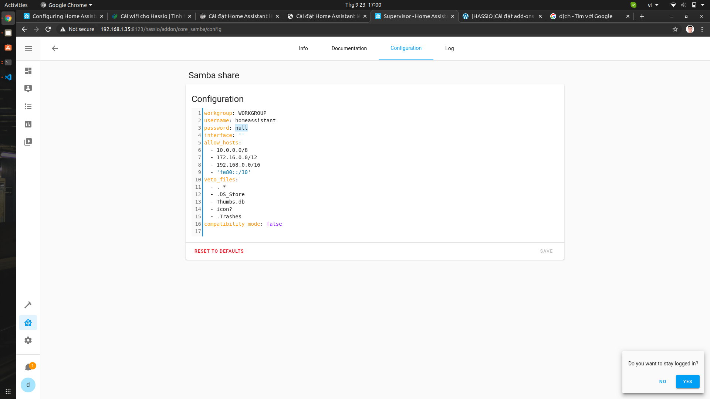

# Hướng dẫn cài đặt Home Assistant cho Raspberry PI 3 trên Ubuntu

* Download [Home Assistant - HASS](https://www.home-assistant.io/hassio/installation)
    * Chọn **Raspberry Pi 3 Model B and B+ 32-bit (recommended)**



* Download phần mềm [Etcher](https://www.balena.io/etcher) để cài đặt HASS vào thẻ nhớ.



* Click **Download for Linux** và tiến hành cài đặt lên máy tính Ubuntu.
* Cài đặt HASS vào thẻ nhớ
    * Sau khi hoàn thành cài đặt Etcher, mở phần mềm lên.
    * Chọn dấu **+** để tiến hành chọn bản HASS mới download.
    * Chọn thẻ nhớ để tiến hành cài đặt.
    * Nhấn **Flash!** để tiến hành cài đặt.



## Setup WiFi cho HASS

**Tạo USB CONFIG:**

* Sử dụng 1 USB format theo chuẩn FAT32 và đổi tên thành **CONFIG**.
* Tạo 1 thư mục đặt tên là network.
* Trong thư mục network tạo một File đặt tên là my-network (không có phần mở rộng).

Nội dung file my-network:

```bash
[connection]
id=my-network
uuid=72111c67-4a5d-4d5c-925e-f8ee26efb3c3
type=802-11-wireless

[802-11-wireless]
mode=infrastructure
ssid=Sunshine Tech
#Uncomment below if your SSID is not broadcasted
#hidden=true

[802-11-wireless-security]
auth-alg=open
key-mgmt=wpa-psk
psk=sunshinetech436

[ipv4]
method=auto

[ipv6]
addr-gen-mode=stable-privacy
method=auto
```

Thay đổi **ssid** và **psk** là tên WiFi và Password.

## Sử dụng HASS

* Cắm USB và thẻ nhớ vào Raspberry PI, truy cập http://IP:8123. Lúc này ta sẽ nhìn thấy giao diện đầu tiên của Home Assistant và chờ cho quá trình cài đặt hoàn tất.



* Tạo tài khoản.



* Thực hiện các bước tiếp theo. Sau khi hoàn thành, ta sẽ nhìn thấy giao diện



## Add-ons - Tiện ích bổ sung

### Add-ons Samba: Samba có thể duyệt các File cấu hình trong Raspberry PI thông qua mạng LAN. Cụ thể là nó có thể chỉnh sửa File nằm trong Raspberry PI bằng máy tính.

* Click **Superisor** sau đó chọn **Add-on store**



* Click **Samba share** rồi **Install** và **Start**

**Chú ý: Chuyển qua tag Configuration để điền username và password!**



### Tương tự với các Add-ons khác
