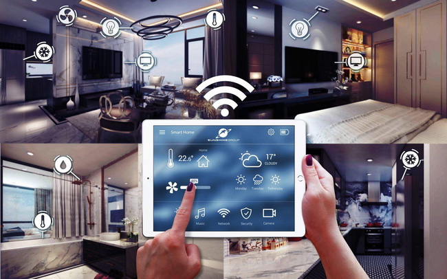
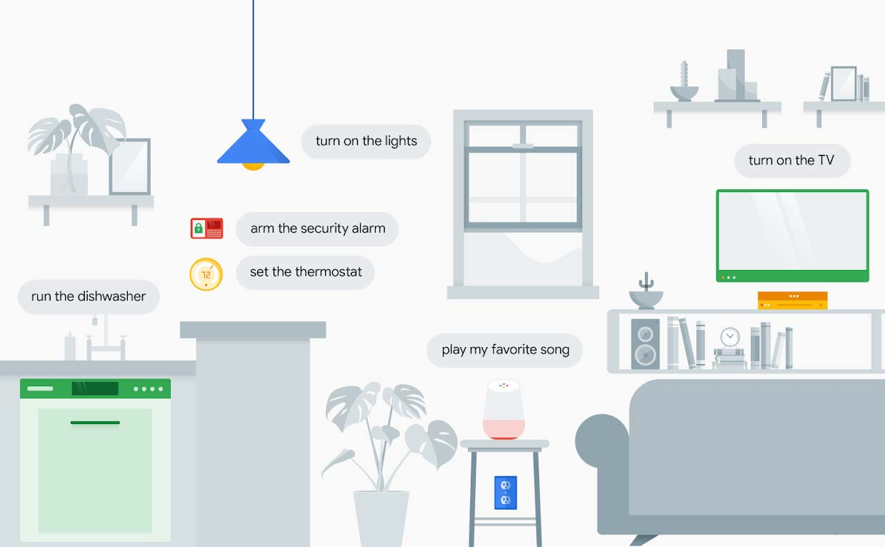
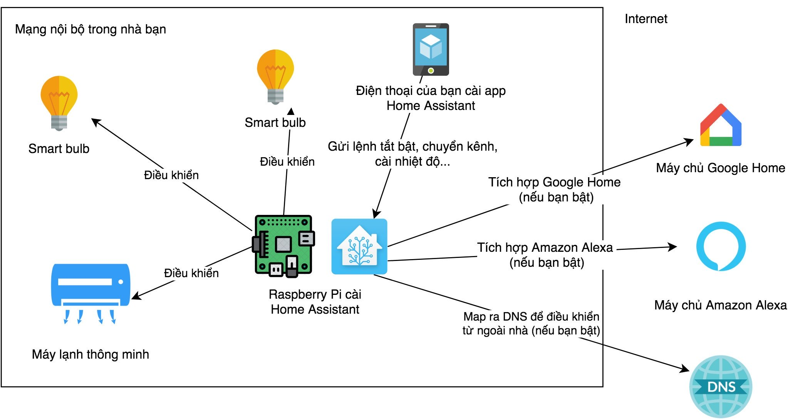
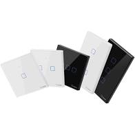
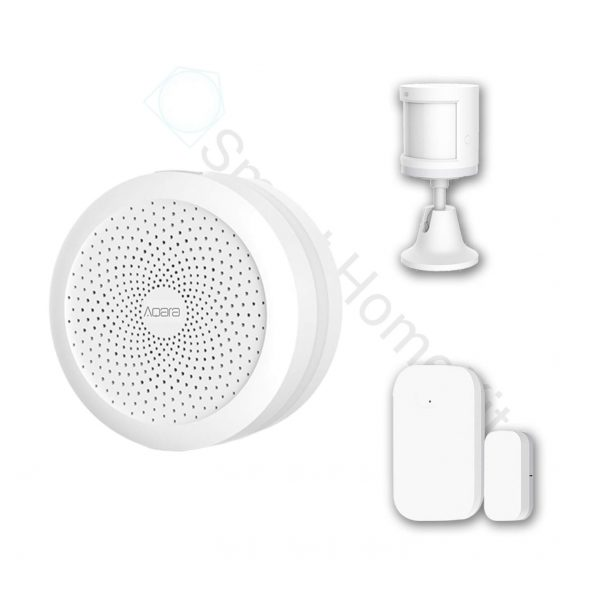
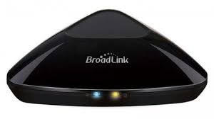
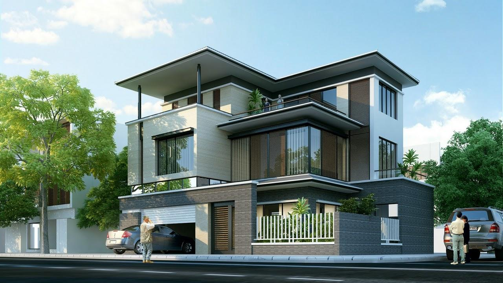
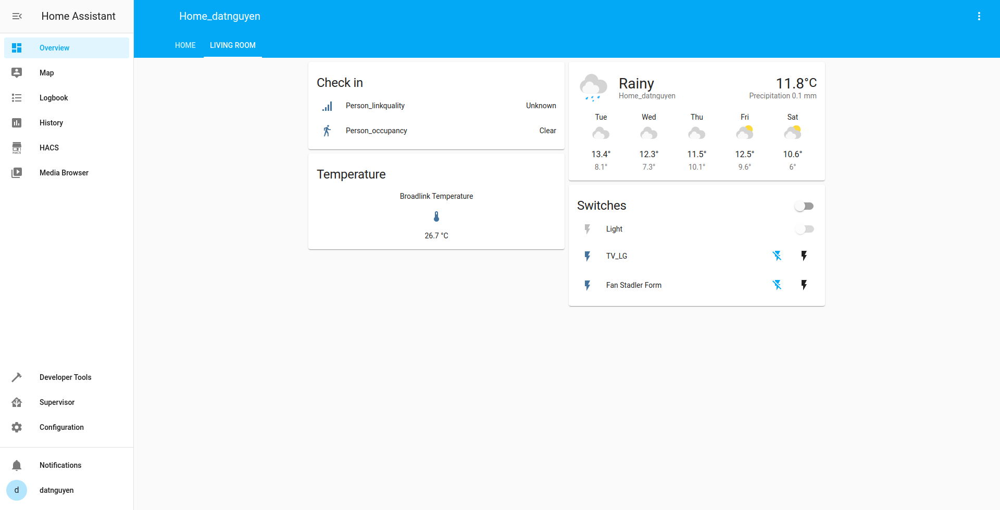

# Giải pháp tổng thể cho hệ thống Smarthome

Với mục tiêu phổ biến rộng rãi hệ thống SmartHome tại Việt Nam theo làn sóng cách mạng công nghiệp 4.0. Nhà thông minh là một giải pháp để tự động hóa cuộc sống của mọi người. Điều khiên căn nhà chỉ với một cái chạm hay sử dụng bởi chính giọng nói hoặc chỉ cần đi vào căn nhà và mọi thứ đều tự động khởi động từ đèn, nhiệt độ máy lạnh,.. mà bạn thiết lập từ trước.

## Điều khiển trên màn hình cảm ứng

Thông thường, để điều khiển các thiết bị trong nhà, ta cần rất nhiều công tắc hoặc Remote. Nhưng đối với hệ thống SmartHome, ta chỉ cần thực hiện một số thao tác bật tắt trên màn hình Smartphone hoặc máy tính bảng.

Mỗi khi đi làm về, thay vì phải di chuyển đến các vị trí công tắc hay Remote đề bật đèn, điều hòa, mở rèm cửa... thì bây giờ chỉ cần cầm trên tay Smartphone hoặc máy tính bảng là bạn có thể thực hiện toàn bộ những thao tác trên một cách dễ dàng hoặc thậm chí bạn có thể làm những việc đó mà không cần có mặt ở trong nhà.

## Điều khiển bằng giọng nói

Không chỉ điều khiển trực tiếp trên Smartphone, máy tính bảng mà bây giờ bạn có thể điều khiển thiết bị bằng giọng nói của mình. Hiện nay, các công nghệ trợ lý ảo như Google Assistant, Amazon Alexa... phát triển mạnh mẽ giúp bạn giao tiếp với hệ thống một cách dễ dàng và thân thiện hơn. Sẽ là một trải nghiệm tuyệt vời nếu bạn ra lệnh bằng giọng nói và hệ thống đáp ứng lại những gì bạn cần.

## Sơ đồ kết nối hệ thống

### Hệ thống chiếu sáng thông minh

Hệ thống chiếu sáng của căn nhà có thể được chia ra thành nhiều khu vực khác nhau, ngoài phương pháp bật tắt thông thường qua công tắc hoặc Smartphone thì việc tích hợp thêm cảm biến chuyển động để nhận diện chuyển động trong khu vực cũng là một giải pháp tương đối tốt với cả mục đích tự động hóa ngôi nhà với việc tiết kiệm năng lượng.

Trong trường hợp sử dụng cảm biến chuyển động để bật tắt đèn, ta cần thực hiện một số kịch bản kèm theo. Ví dụ, khi phát hiện chuyển động thì bật đèn, sau một khoảng thời gian (Ví dụ 5 phút) nếu không có chuyển động thì tắt đèn.

Tuy nhiên, một lưu ý khi sử dụng cảm biến chuyển động trong hệ thống chiếu sáng là cần phải đặt ở những nơi mà việc bật/tắt đèn không ảnh hưởng quá nhiều đến bạn như trong phòng tắm hoặc trong khu vực bếp...

Ngoài ra còn có thể sử dụng cảm biến ánh sáng để điều chỉnh bật/tắt đèn cho phù hợp hoặc rèm cửa thông minh để đóng/mở rèm khi có ánh nắng mặt trời chiếu trực tiếp.

- Để điều khiển bật tắt đèn, có thể sử dụng công tắc Sonoff hoặc công tắt cảm ứng cửa Tuya...
- Cảm biến chuyển động có thể sử dụng của XiaoMi hoặc Aqara.
- Cảm biến ánh sáng có thể sử dụng của XiaoMi.

## Hệ thống an ninh thông minh, hệ thống kiểm soát môi trường

Hệ thống an ninh trong ngôi nhà đóng vai trò cực kỳ quan trọng, nó mang đến cho bạn một cảm giác an toàn hơn và thoải mái hơn trong chính ngôi nhà của bạn. Hệ thống an ninh có thể bao gồm một số thiết bị:
- Camera an ninh: phát hiện người lạ xuất hiện trong khu vực của bạn - có thể sử dụng Camera của XiaoMi.
- Cảm biến chuyển động: phát hiện những chuyển động bất thường - có thể sử dụng của XiaoMi hoặc Aqara.
- Cảm biến rung: được gắn trên các cửa kính để cảnh báo mở cửa hoặc phá vỡ cửa kính - có thể sử dụng của Aqara.
- Hàng rào điện tử:
- Chưông báo động: dùng để báo động nếu có bất kỳ phát hiện nào từ các loại thiết bị trên.
- Bên cạnh đó, một ổ khóa thông minh Smart Lock để kiểm soát ra/vào ngôi nhà bằng vân tay, mã số, thẻ từ... cũng thực sự cần thiết.

Ngoài ra, hệ thống kiểm soát môi trường của giúp ngôi nhà của bạn tránh khỏi các sự cố ngoài ý muốn như:
- Cảm biến khói: phát hiện khói và gửi cảnh báo với điện thoại - có thể sử dụng của XiaoMi.
- Cảm biến rò rỉ nước: phát hiện nước bị rò rỉ tại các vị trí ít được chú ý tời - có thể sử dụng của Aqara.
- Cảm biến khí Gas: phát hiện rò rỉ gas, giúp hạn chế cháy nổ - có thể sử dụng của Aqara.

## Hệ thống điều khiển thay thế Remote

Những thiết bị gia dụng không thể thiếu trong căn nhà như TV, điều hòa... Đa số chúng đều được điều khiển bằng Remote riêng của nhà sản xuất và khá cồng kềnh khi sử dụng quá nhiều Remote như vậy. Việc nhầm lẫn các Remote với nhau là vẫn có xảy ra. Để khắc phục vấn đề này, Broadlink được đưa vào hệ thống SmartHome với mục đích học lệnh từ các Remote và kết nối trực tiếp đến hệ thống giúp ta có thể điều khiển các thiết bị một cách dễ dàng thông qua Smartphone hoặc điều khiển bằng giọng nói.

## Kịch bản điều khiển SmartHome

Một kịch bản điều khiển giúp ta điều khiển căn nhà một cách dễ dàng và khoa học hơn. Ví dụ, khi ta ra khỏi nhà và muốn tắt hết các thiết bị điện trong nhà thì việc đơn giản chỉ là tạo một nút kịch bản cho phép làm tất cả các công việc này. Như vậy, khi muốn tắt hết tất cả các thiết bị điện trong nhà, ta chỉ cần nhấn vào nút kịch bản này. Tương tự như vậy, ta cũng có thể thêm nhiều nút kịch bản khác nhau cho từng mục đích sử dụng khác nhau nhờ vậy mà có thể tiết kiệm tối đa thời gian điều khiển thiết bị.

## Kết nối không giới hạn

Bạn có thể kiểm soát ngôi nhà của bạn ở bất kỳ đâu, chỉ cần điện thoại hay máy tính bảng của bạn có kết nối Internet. Ngoài ra, bạn có thể chia sẻ quyền kiểm soát ngôi nhà của bạn với nhiều người dùng khác nhau giúp cho tất cả mọi người trong nhà đều có thể kiểm soát được.

## Giải pháp cho một biệt thự thông minh

Giả sử xây dựng hệ thống SmartHome với một căn biệt thự diện tích khoảng 500m2.

**Sử dụng Home Assistant để quán lý**

**Các thiết bị sử dụng**

* Raspberry Pi cài đặt HASS.
* Smartphone, máy tính bảng có cài đặt phần mềm Home Assistant.
* Các loại công tắc thông minh để điều khiển các thiết bị đèn, đồ gia dụng...
* Broadlink để điều khiểu các thiết bị thay thế Remote.
* Hệ thống an ninh và kiểm soát môi trường.
* Google Assistant.
* ...

**Chi tiết**

Phòng khách gồm các thiết bị:

* Điều hòa
* TV
* Loa
* Các thiết bị đèn
* Rèm cửa
* ...

Phòng bếp + phòng ăn gồm các thiết bị:

* Tủ lạnh
* Bếp từ
* Lò vi sóng
* Máy hút mùi
* Các thiết bị đèn
* Cảm biến chuyển động
* Các cảm biến khói, rò rỉ nước, khí gas...
* ...

Phòng ngủ (4 phòng) gồm các thiết bị:

* Điều hòa
* TV
* Loa
* Các thiết bị đèn
* Rèm cửa
* ...

Nhà vệ sinh gồm:

* Máy nóng lạnh
* Các thiết bị đèn
* Cảm biến chuyển động
* ...

Hiện thực: Sau khi lắp đặt các thiết bị đèn, rèm cửa, an ninh, báo cháy... Tiến hành kết nối các thiết bị với Home Assistant để có thể điều khiển.

Hình ảnh mô phỏng phòng khách của ngôi nhà

Tương tự với các phòng còn lại.
