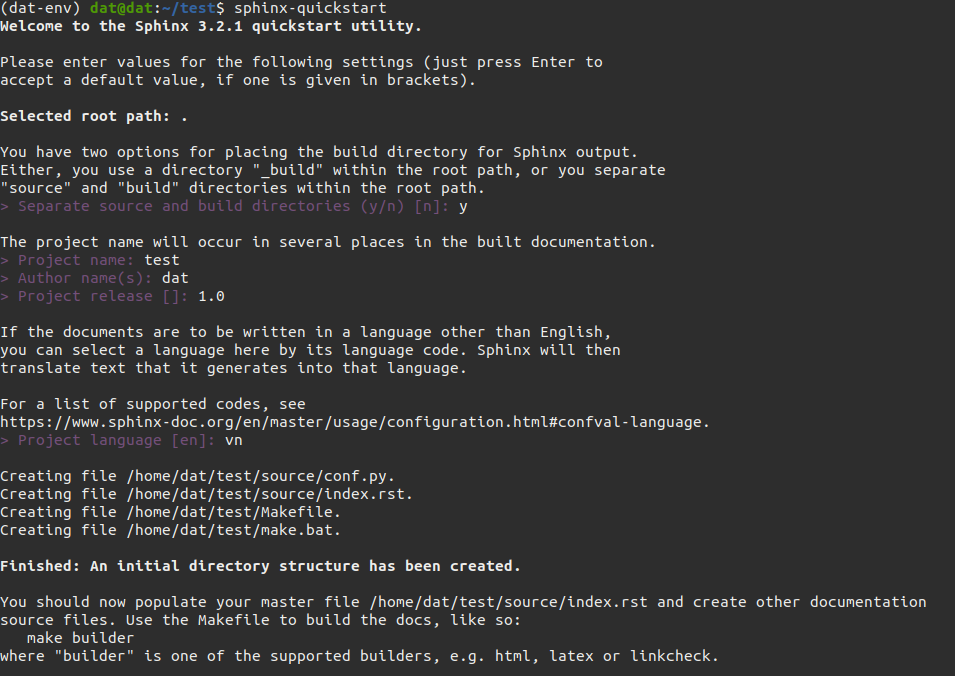
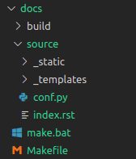
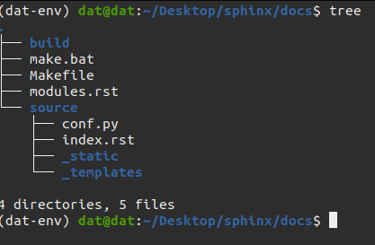
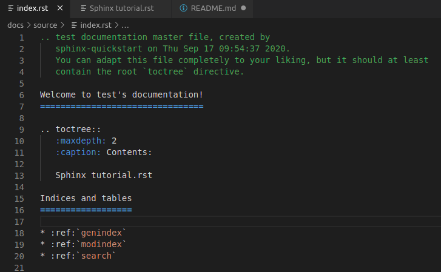
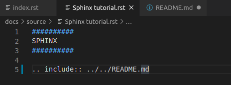
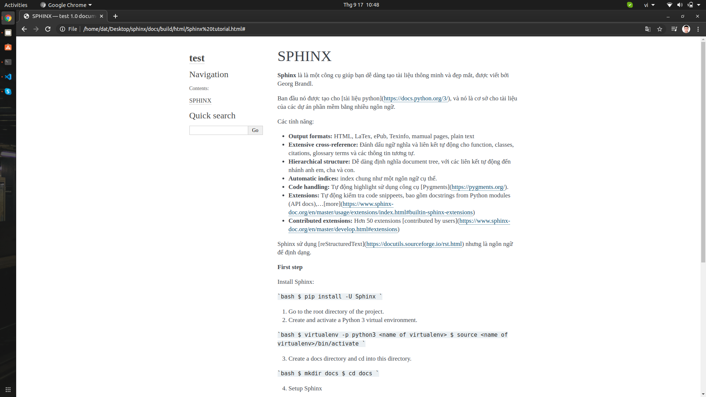

# Sphinx

**Sphinx** là là một công cụ giúp bạn dễ dàng tạo tài liệu thông minh và đẹp mắt, được viết bởi Georg Brandl.

Ban đầu nó được tạo cho [tài liệu python](https://docs.python.org/3/), và nó là cơ sở cho tài liệu của các dự án phần mềm bằng nhiều ngôn ngữ.

Các tính năng:

* **Output formats:** HTML, LaTex, ePub, Texinfo, mamual pages, plain text
* **Extensive cross-reference:** Đánh dấu ngữ nghĩa và liên kết tự động cho functions, classes, citations, glossary terms và các thông tin tương tự.
* **Hierarchical structure:** Dễ  dàng định nghĩa document tree, với các liên kết tự động đến nhánh anh em, cha và con.
* **Automatic indices:** index chung như một ngôn ngữ cụ thể.
* **Code handling:** Tự động highlight sử dụng công cụ [Pygments](https://pygments.org/).
* **Extensions:** Tự động kiểm tra code snippets, bao gồm API docs,...[more](https://www.sphinx-doc.org/en/master/usage/extensions/index.html#builtin-sphinx-extensions)
* **Contributed extensions:** Hơn 50 extensions [contributed by users](https://www.sphinx-doc.org/en/master/develop.html#extensions)

Sphinx sử dụng [reStructuredText](https://docutils.sourceforge.io/rst.html) nhưng là ngôn ngữ để định dạng.

**First step**

Install Sphinx:

```bash
$ pip install -U Sphinx
```

1. Đến thư mục của project.

2. Tạo và activate môi trường Python.

```bash
$ virtualenv -p python3 <name of virtualenv>
$ source <name of virtualenv>/bin/activate
```

3. Tạo folder.

```bash
$ mkdir docs
$ cd docs
```

4. Setup Sphinx

```bash
$ sphinx-quickstart
```

Fill các thông tin cần thiết.



* Separate source and build directories (y/n) [n]: y --> Giúp tạo ra 2 folder build và source bên trong folder docs.
* Sau bước này trong folder trông sẽ như sau:



Sau khi hoàn thành nhanh các bước. Ta thấy như sau:



File index.rst là tập tài liệu ban đầù của bạn. Mở rộng thư mục bằng cách add thêm file.rst bổ sung vào thư mục này.

6. Build.

```bash
$ make html
```

7. source/index viết toctree



8. Include file README.md



9. Rebuilde.

```bash
$ make html
```

10. Check tại build/html/index.html



