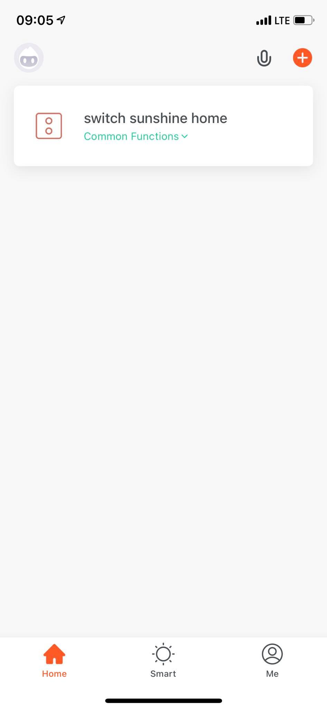
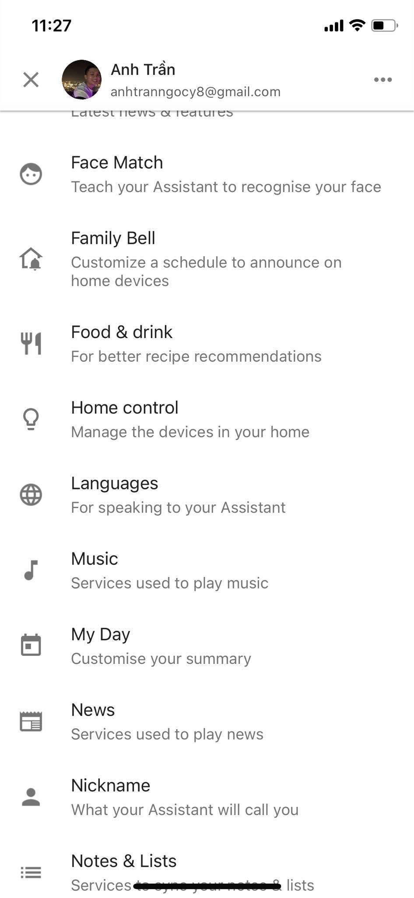

# Hướng Dẫn Kết Nối Công Tắc Thông Minh Tuya Và Google Home Mini Với Home Assistant

## I. Kết nối công tắc thông minh Tuya với Home Assistant :

### Bước 1: Chuẩn bị và kết nối các thiết bị với nguồn điện
* Mô hình và các đi dây cho công tắc

  

### Bước 2: Kết nối công Tắc Tuya với ứng dụng của nhà sản xuất *"TuyaSmart"*.

* Tải App TuyaSmart trên AppStore hoặc CHPlay

  

* Đăng ký tài khoản và đăng nhập vào ứng dụng Tuya đã tải

  

* Giao diện màn hình chính khi đăng nhập, nhấn vào icon dấu "+" màu cam góc trên bên phải màn hình để thêm thiết bị

  

* Kéo xuống danh sách thiết bị, chọn Scenario Switch (Wi-Fi)

  

* Kết nối thiết bị công tắc Tuya với WiFi tại nhà

  

* Nhấn giữ vào thiết bị để kích hoạt trạng thái chờ kết nối và chờ cho đến khi hoàn thành kết nối

  

* Nếu thời gian hết 2 phút vẫn chưa kết nối được thì làm lại từ bước thêm thiết bị

  

* Kết nối thành công, thiết bị đã được tìm thấy

  

### Bước 3: Cấu hình cài đặt Home Assistant.

* Đăng nhập Home Assistant -> Chọn Supervisor -> Chọn Add-on Store -> install File editor(Xem thêm hướng dẫn ở bài [Hướng dẫn cài đặt Home Assistant cho Raspberry PI 3 trên Ubuntu](./SetupHASS.html))

  

* Mở giao diện chính của [Home Assistant](https://www.home-assistant.io/) -> chọn Intergrations

  

* Tìm kiếm Tuya

  

* Tìm kiếm Configuration via YAML, copy đoạn code config

  

* Cách 1: Ấn vào icon folder ở góc trên bên trái màn hình -> Lưu ý tìm đúng folder như hướng dẫn của Tuya -> Dán đoạn code config vào File editor (/config/configuration.yaml)

* Cách 2: SSH vào raspberry để điều chỉnh trực tiếp (Xem thêm hướng dẫn ở bài docs "Kết nối các thiết bị với Home Assistant")

* Lưu trạng thái vừa được cập nhật

  

* Chọn Configuration -> Chọn General -> Chọn Server Controls

  

* Tiến hành kiểm tra config -> Chọn CHECK CONFIGURATION

* Chọn RESTART ở mục Server management để tiến hành khởi động lại Home Assistants

  

### Bước 4: Tìm kiếm và thêm thiết bị vào Home Assistant

* Chọn Developer Tools

    

* Tìm kiếm tên thiết bị đã được đặt ở trong TuyaSmart app

    

* Tiến hành thiết lập trạng thái cho thiết bị

    

* Thêm thiết bị vào Home -> Overview -> Góc trên bên phải màn hình -> Chọn Edit Dashboard

    

    

    

## II. Kết nối Google Home Mini với Home Assistant :

### Bước 1: Kết nối thiết bị Google Home Mini với ứng dụng của nhà sản xuất *"Google Home"*

Video hướng dẫn : https://www.youtube.com/watch?v=eO9Es81unB0&t=435s

### Bước 2: Tạo tài khoản Home Assistant Cloud

* Chọn Configuration -> Chọn Home Assistant Cloud

    

* Tiến hành đăng ký tài khoản theo hướng dẫn

    

### Bước 3: Kết nối ứng dụng Goole Home với Home Assistant Cloud

* Chọn mục Profile ở góc trên bên phải màn hình -> Chọn Assistants Settings

  

* Chọn Home Control

  

* Chọn vào biểu tượng thêm vào ở góc dưới bên phải màn hình

  

* Tìm kiếm thông tin thiết bị cần link

  

* Tìm Home Assistants -> Chọn mục đầu tiên

  

* Nhập tài khoản Home Assistant cloud

  

### Bước 4: Đồng bộ các thiết bị ở Home Assistant với App Google Home.

* Tiến hành thêm thiết bị từ Home Assistants xuống Google Home

  

* Thêm thiết bị vào home của mình mong muốn

  

* Thêm thiết bị vào phòng mình mong muốn

  

  
