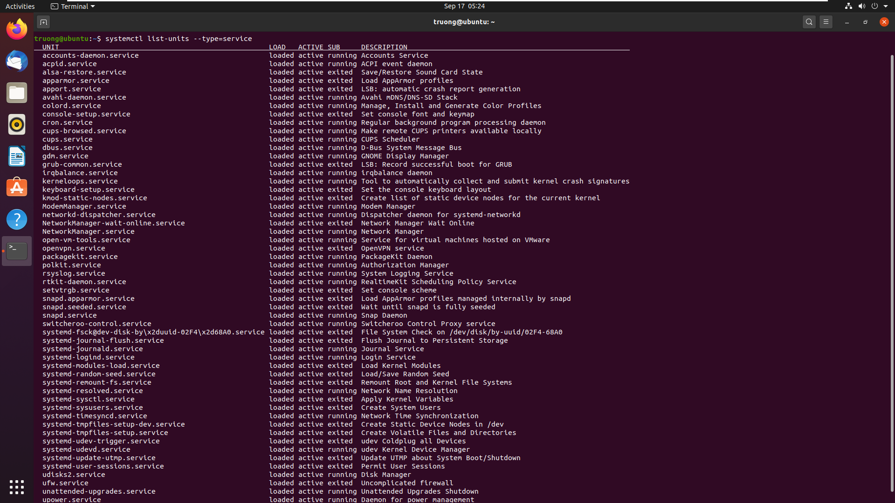
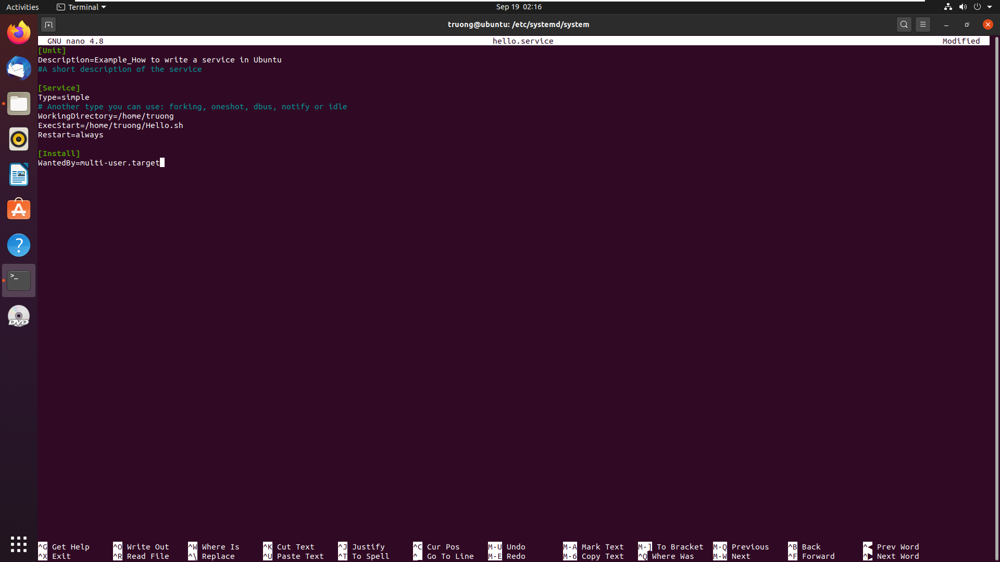
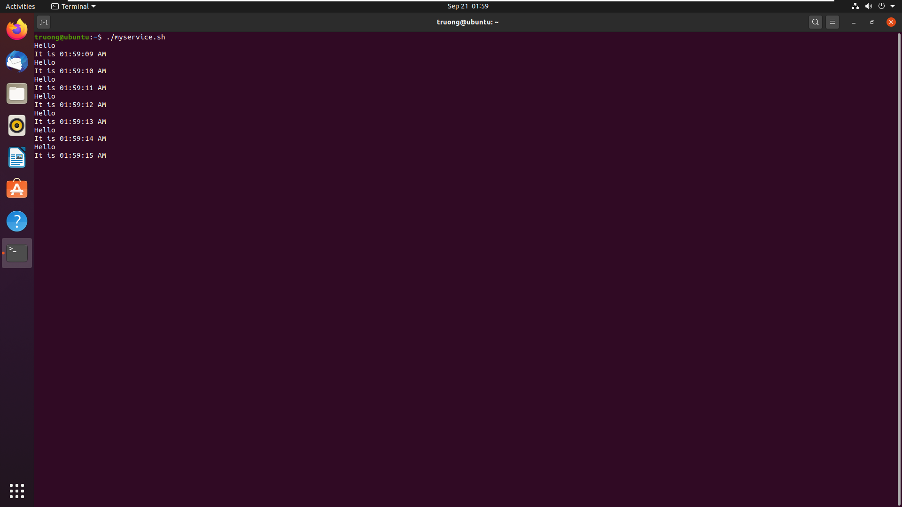
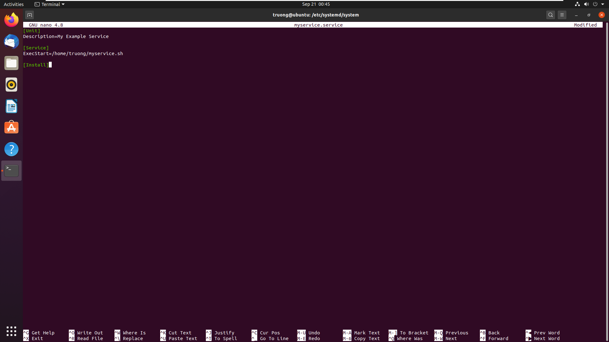
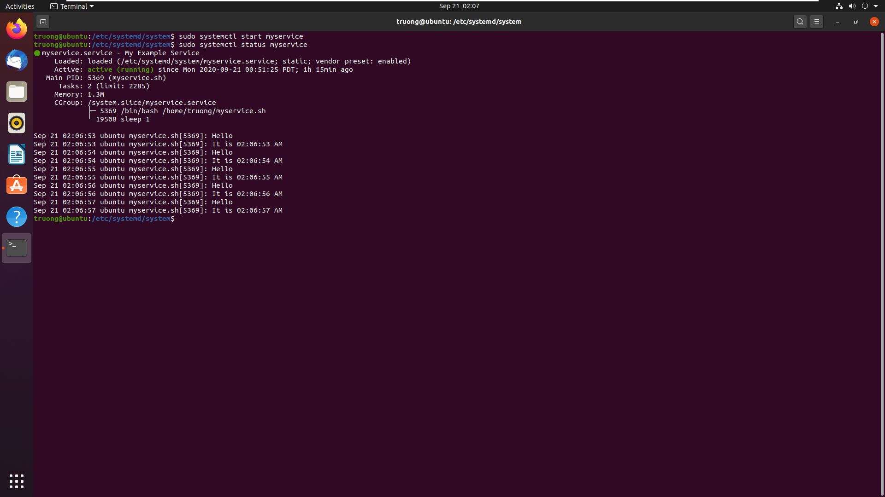
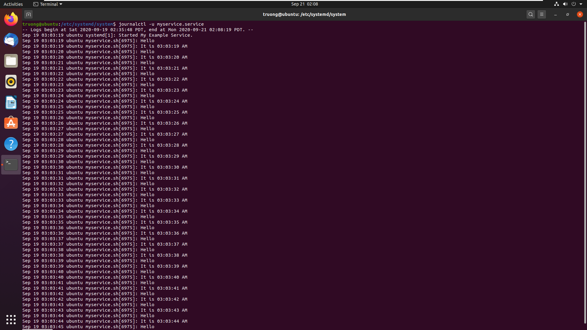

# Service trong Ubuntu

## Service là gì?
Serivce (dịch vụ) là những tiến trình cơ bản (hoặc một Unit) hoạt động khi hệ điều hành khởi động, được quản lý bởi hệ thống `Systemd` (kể từ version 15), và luôn ở chế độ chạy ngầm hoặc chạy nền (background).

Các Service thường được cấu hình trong các file riêng biệt và quản lý thông qua câu lệnh `systemctl`. Ta có thể xem các Service trong Ubuntu bằng lệnh:

```bash
$ systemctl list-units --type=service
```

hoặc

```bash
$ systemctl --type=service
```



*Sau khi sử dụng lệnh để hiển thị toàn bộ service*

## Một số thao tác với Service

* Chạy (start) một service.

```bash
$ systemctl start <service-name>
```

* Dừng (stop) một service.

```bash
$ systemctl stop <service-name>
```

* Khởi động lại (restart) một service.

```bash
$ systemctl restart <service-name>
```

* Tải lại (reload) một service.

```bash
$ systemctl restart <service-name>
```

* Khởi động (enable) một service.

```bash
$ systemctl enable <service-name>
```

* Vô hiệu hóa (disable) một service.

```bash
$ systemctl disable <service-name>
```

* Kiểm tra trạng thái của một service.

```bash
$ systemctl status <service-name>
```

## Cách để tạo một Service trong Ubuntu

### Cấu tạo của một service
Một service trong Ubuntu thường gồm 3 phần chính: `[Unit]`, `[Service]`, `[Install]`.

* `[Unit]` và `[Install]` bao gồm các mục cấu hình thông thường của service.

* `[Service]` bao gồm các tùy chọn cấu hình riêng của service.



*Ví dụ về cấu trúc của một file Service*

Cách để kiểm tra tất cả các tùy chọn cấu hình của Service:

```bash
$ man systemd.unit
```

### Cách để tạo một Service trong Ubuntu
 * Tạo mới một Systemd Service File trong `/etc/sytemd/system` với đuôi file *.service*. Ví dụ *Myservice.service*.

```bash
$ cd /etc/systemd/system
$ sudo vim Myservice.service
```

 * Thêm các tùy chỉnh cấu hình của Service vào file đã tạo để có thể quản lý bằng `systemctl`.

 **Ví dụ:**

```
[Unit]
Description=My example Service

[Service]
ExecStart=/usr/sbin/Myservice

[Install]
WantedBy=multi-user.target
```

* Sau khi lưu hoặc thay đổi các tùy chỉnh file Service thì cần reload lại các tùy chỉnh trong systemd.

```bash
$ sudo systemctl daemon-reload
```

* Quản lý Service bằng các lệnh `Start`, `Stop`, `Restart` và kiểm tra trạng thái của Service bằng `Status`.

```bash
$ sudo systemctl start Myservice
$ sudo systemctl stop Myservice
$ sudo systemctl restart Myservice
$ systemctl status Myservice
```

* Có thể cho phép Service tự khởi động cùng với hệ thống mà không cần `Start`.

```bash
$ sudo systemctl enable Myservice
```

Hoặc vô hiệu hóa Service đó.

```bash
$ sudo systemctl disable Myservice
```

* Kiểm tra log của Service.

```bash
$ journalctl -u Myservice
```

### Tham khảo

#### Cách tạo Service cho một Shell Script đơn giản
Ở đây, ta tạo một Shell Script đơn giản in ra màn hình dòng chữ `Hello` và `It is <thời gian hiện tại>`.

* **Bước 1**: Tạo một Shell Script (*.sh) mới chứa các lệnh thực thi.

```
#! /bin/bash
while true
do
  echo "Hello"
  echo "It is $(date + "%r")"
done
```

Ta có thể dùng `nano` để tạo file mới rồi sau đó thêm các lệnh vào.

```bash
$ sudo nano <File_Name>.sh
```

* **Bước 2**: Cấp quyền thực thi cho Shell Script vừa tạo.

```bash
$ chmod +x <File_Name>.sh
```
Và kiểm tra Shell script có thực thi được không.

```bash
$./<File_Name>.sh
```



* **Bước 3**: Vào đường dẫn `/etc/systemd/system`, tạo một file Service (*.service) mới bằng `nano` hoặc `cat` và các tùy chỉnh về cấu hình.



Trong `[Service]`, phần `ExecStart` ta thêm đường dẫn chứa Shell Script đã tạo, các phần khác có thể cấu hình tùy theo mục đích sử dụng.

* **Bước 4**: Thực hiện các thao tác quản lý service vừa tạo.

 * Chạy service đã tạo.

 ```bash
 $ sudo systemctl start <Service_Name>
 ```

 * Kiểm tra trạng thái của service.

 ```bash
 $ sudo systemctl status <Service_Name>
 ```

 

 * Xuất log của service.

 ```bash
 $ journalctl -u <Service_Name>
 ```
 
