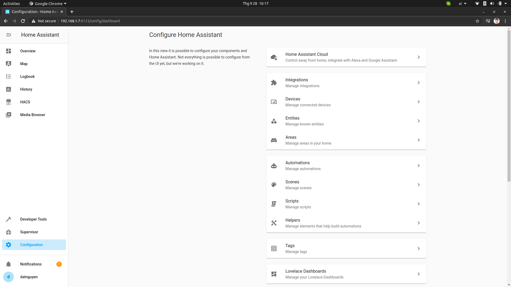
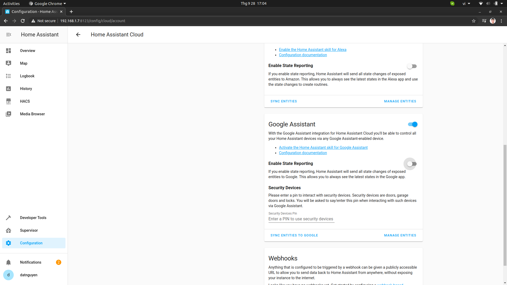
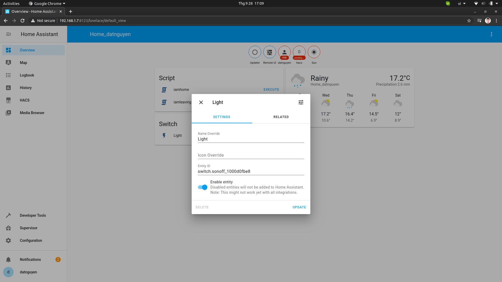
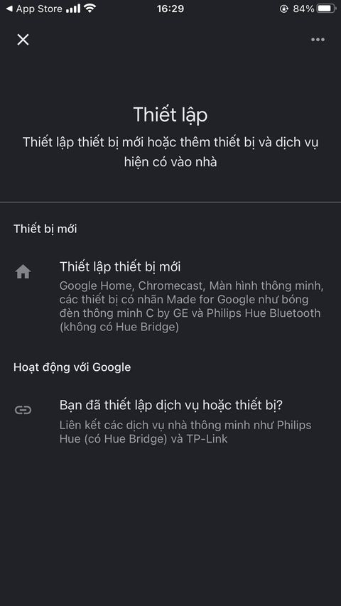
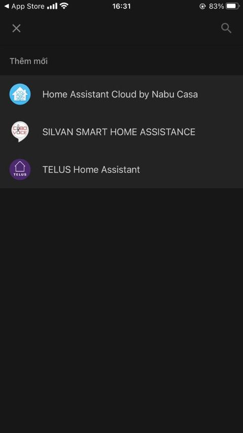
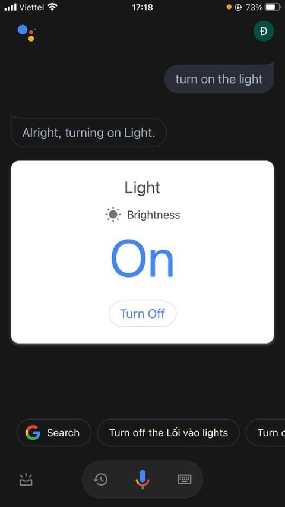

# Điều khiển thiết bị bằng giọng nói
Hiện nay, rất nhiêu nhà phát triển như Google, Alexa,... đã phát triển công nghệ nhà thông minh có sử dụng giọng nói để điều khiển các thiết bị. Trong bài hướng dẫn này, ta sử dụng Google Home để kết nối và điều khiển thiết bị Sonoff.

## Bước 1: Tạo Cloud HASS

* Tạo tài khoản Cloud HASS [tại đây](https://auth.nabucasa.com/signup?redirect_uri=https://account.nabucasa.com&response_type=code&client_id=615cqgr6bcsb7lhvkmfuceqsqu)

* Đăng nhập: **Configuraton > Home Assistant Cloud** sử dụng tài khoản vừa tạo để đăng nhập

* Kích hoạt Google Assistant: Chuyển thanh trượt Slider sang On.

* Đổi tên thiết bị:

Click vào thiết bị, chọn cài đặt và đặt tên cho thiết bị. Ví dụ là Light.

## Bước 2: Sử dụng Google Home và Google Assistant

* Tải ứng dụng **Google Home** và **Google Assistant** cho điện thoại.
* Đăng nhập cả 2 thiết bị bằng email tạo Cloud HASS.
* Trên **Google Home**, kết nối với Home Assistant.
* Nếu bạn đã sử dụng Google Home thì ở trên góc trên bên trái chọn dấu cộng.
* Nếu là cài đặt lần đầu.

* Sau đó tìm đến Home Asstant, chọn và đăng nhập bằng cloud vừa tạo.

* Bật Google Assistant và Test với câu **Turn on the Light**

**Đã bật/tắt đèn bằng giọng nói thành công**
