# Cài đặt Zigbee2MQTT và kết nối với thiết bị Zigbee thông qua Zigbee Gateway (Zigbee2MQTT + CC2531)

## Cài đặt Firmware cho CC2531

### Cách 1: Sử dụng CC Debugger và cáp downloader
* **Bước 1**: Kết nối CC Debugger vào máy và tiến hành cài [Driver](http://www.ti.com/general/docs/lit/getliterature.tsp?baseLiteratureNumber=swrc212&fileType=zip). Nếu sau khi cài bằng `Setup_SmartRF_Drivers-1.2.0.exe` mà máy vẫn không nhận driver thì có thể tiến hành cài thủ công:
 - Vào `Device Manager -> Action -> Add legacy hardware`, chọn vào `Install the hardware that I manually select from a list (Advanced)`.

 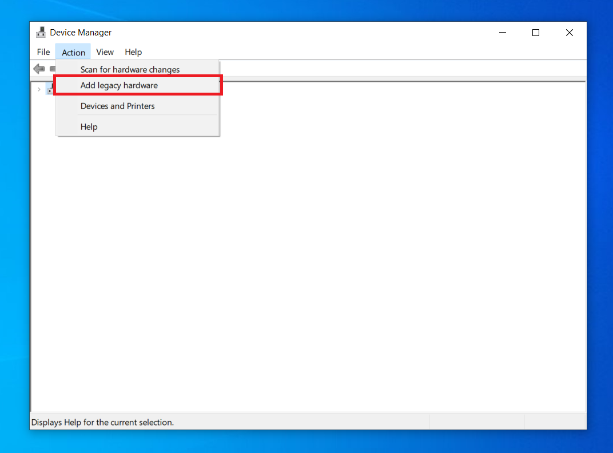

 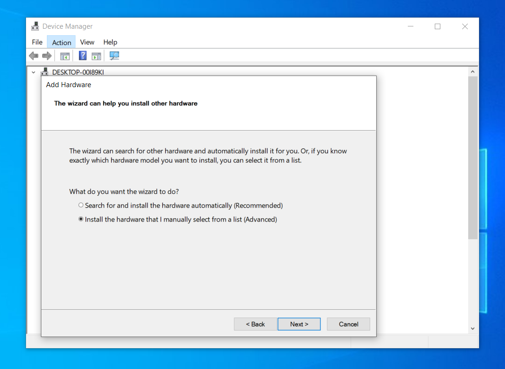

 - Chọn `Show all device`. Nhấn `Have Disk...` và chọn đường dẫn thư mục chứa driver CC Debugger, chọn vào thư mục win32 hoặc win64 (tùy máy tính).

 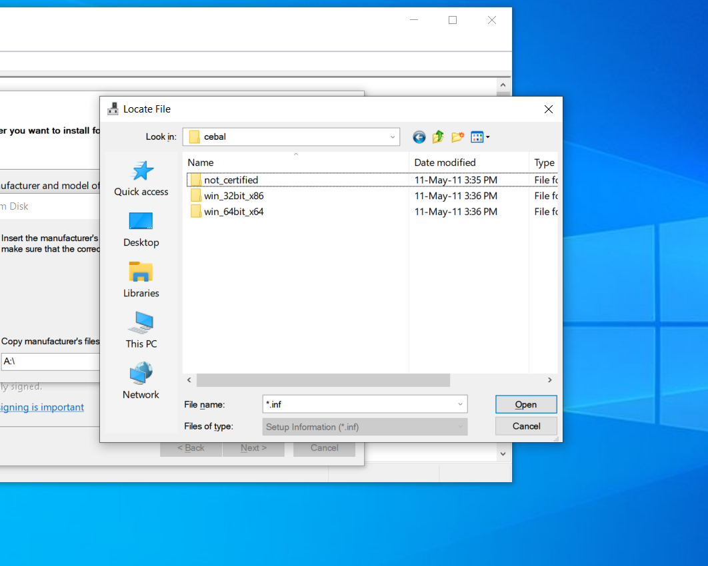

 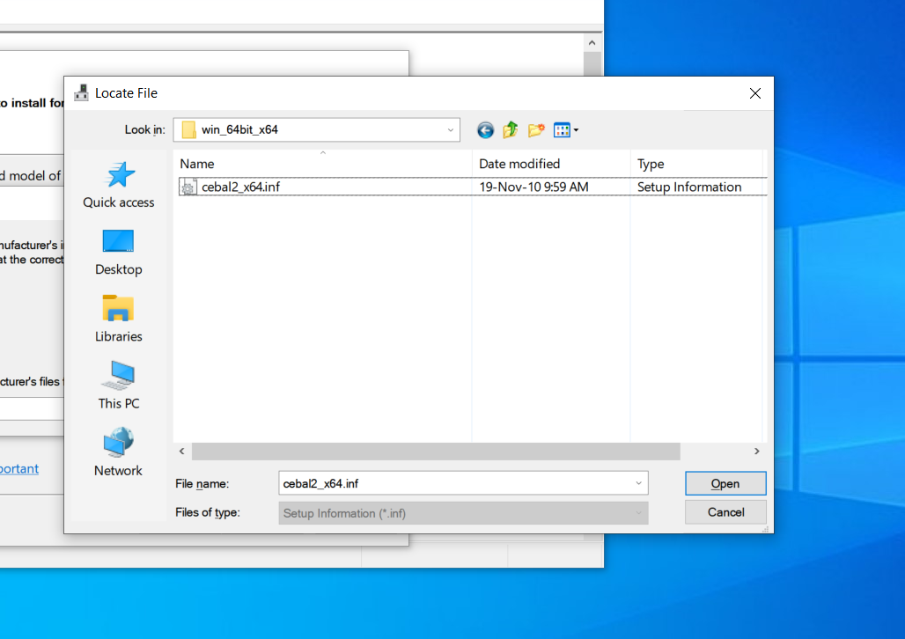

 - Chọn Model CC Debugger và tiến hành cài đặt.

 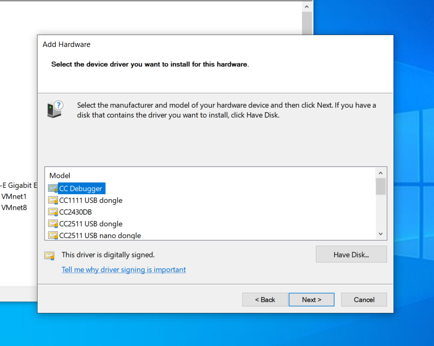

 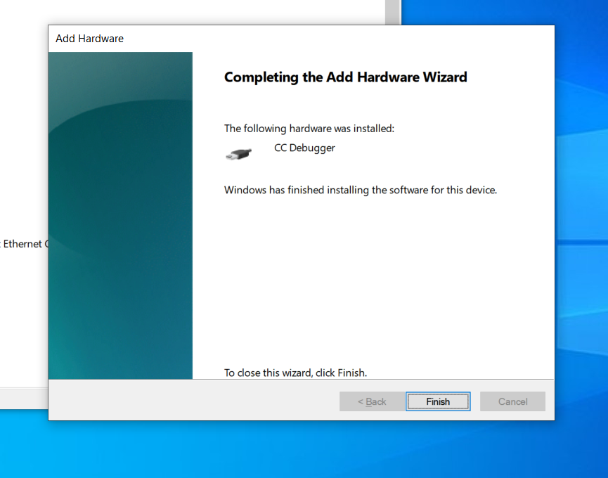

* **Bước 2**: Kết nối CC2531 với cáp downloader và CC debugger.

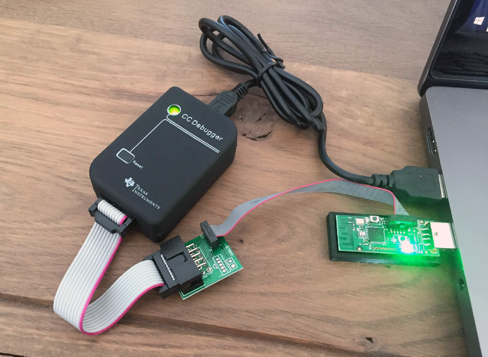

* **Bước 3**: Tải [SmartRF Flash Programmer](https://www.ti.com/tool/FLASH-PROGRAMMER) và tiến hành cài đặt phần mềm.

* **Bước 4**: Tải [Firmware của CC2531](https://github.com/Koenkk/Z-Stack-firmware/raw/master/coordinator/Z-Stack_Home_1.2/bin/default/CC2531_DEFAULT_20190608.zip) và giải nén.

* **Bước 5**: Mở SmartRF Flash Programmer, chọn vào CC2531 cần nạp Firmware được hiển thị ở phần System-on-Chip và chọn đường dẫn tới tới file `.hex` trong thư mục fimware đã giải nén và tiến hành cài đặt.

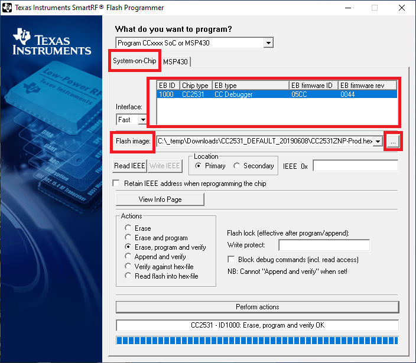

### Cách 2: Sử dụng Raspberry
* **Bước 1**: Kết nối CC2531 với Raspberry thông qua cổng USB và jump wire. Cách kết nối jump wire:

| CC2531  | Raspberry   |
|---------|-------------|
|   GND   |    Pin 39   |
|   DD    |    Pin 38   |
|   DC    |    Pin 36   |
|   RST   |    Pin 35   |

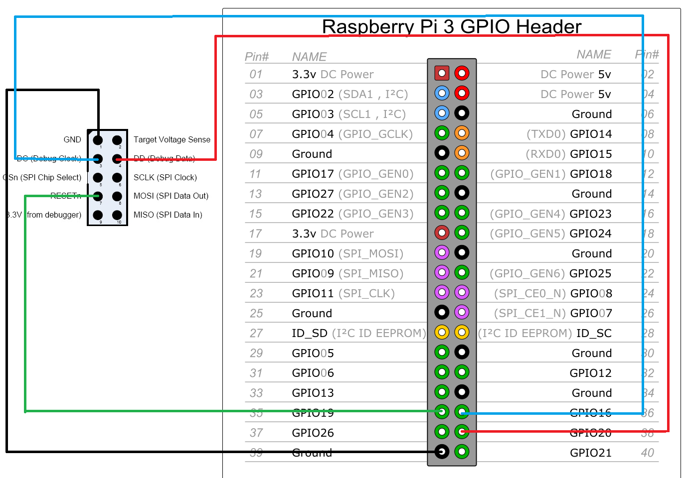

* **Bước 2**: Cấp nguồn, khởi động và SSH vào Raspberry (hoặc có thể làm việc trực tiếp trên Raspberry).

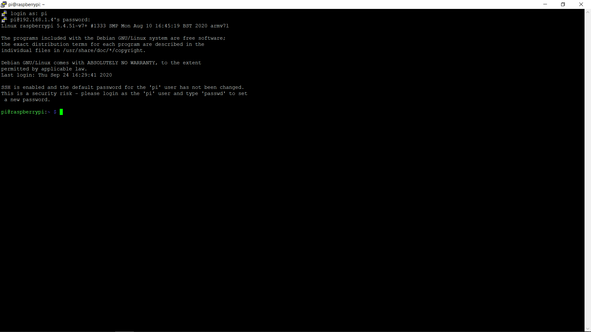

* **Bước 3**: Tải flash_cc2531.

```bash
$ git clone https://github.com/jmichault/flash_cc2531.git
```

Nếu Raspberry chưa cài đặt Git, thì có thể cài bằng lệnh sau:

```bash
$ sudo apt-get install git-core
```
Và kiểm tra xem Git đã được cài thành công chưa bằng lệnh:

```bash
$ git --version
```

* **Bước 4**: Vào thư mục flash_cc2531 vừa tải và tiến hành kiểm tra xem CC2531 đã kết nối vào Raspberry chưa.

```bash
$ cd flash_cc2531
$ sudo ./cc_chipid
```
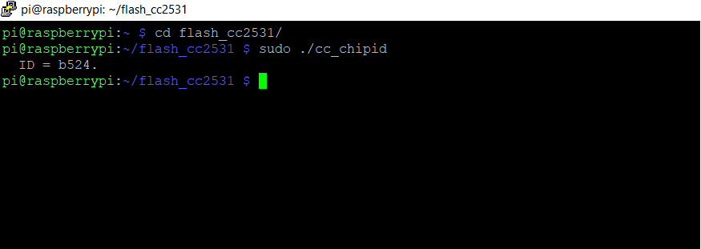

* **Bước 5**: Tải và giải nén Firmware CC2531 vào thư mục flash_cc2531.

```bash
$ sudo wget https://github.com/Koenkk/Z-Stack-firmware/raw/master/coordinator/Z-Stack_Home_1.2/bin/default/CC2531_DEFAULT_20190608.zip
$ sudo unzip CC2531_DEFAULT_20190608.zip
```

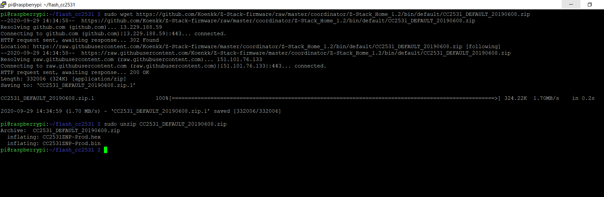

* **Bước 6**: Cài đặt Firmware cho CC2531 (nên xóa các dữ liệu cũ trước khi cài).

```bash
$ sudo ./cc_erase # Xóa dữ liệu hoặc Firmware cũ bên trong
$ sudo ./cc_write CC2531-Prod.hex # Tiến hành ghi Firmware mới
```

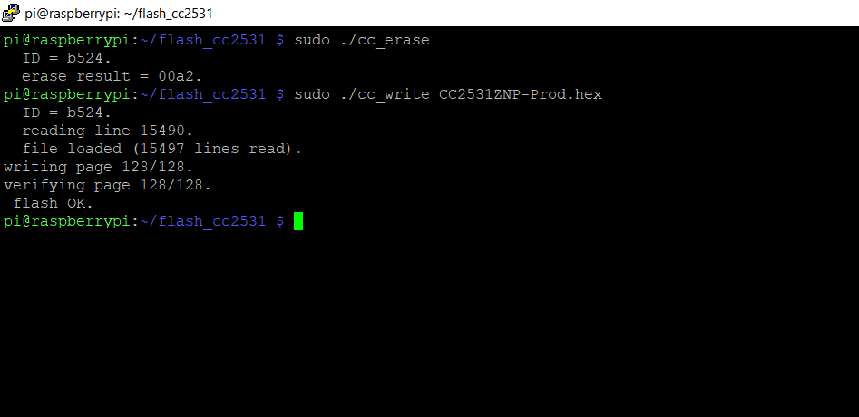

* **Bước 7**: Sau khi quá trình cài đặt kết thúc, ngắt kết nối jump wire và khởi động lại Raspberry.

## Cài đặt Zigbee2MQTT và khởi động Zigbee gateway
* **Bước 1**: Cấp nguồn và khởi động Raspberry. Sử dụng SSH để truy cập vào Raspberry (hoặc có thể làm việc trực tiếp trên Raspberry nếu có các thiết bị ngoại vi).

* **Bước 2:**: Xác định vị trí của CC2531

```bash
$ ls -l /dev/serial/by-id
```

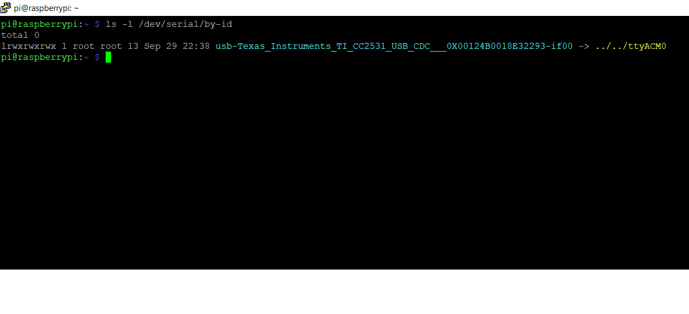

* **Bước 3:** Tải và cài đặt Nodejs trên Raspberry.

```bash
$ sudo curl -sL https://deb.nodesource.com/setup_12.x | sudo -E bash -
```

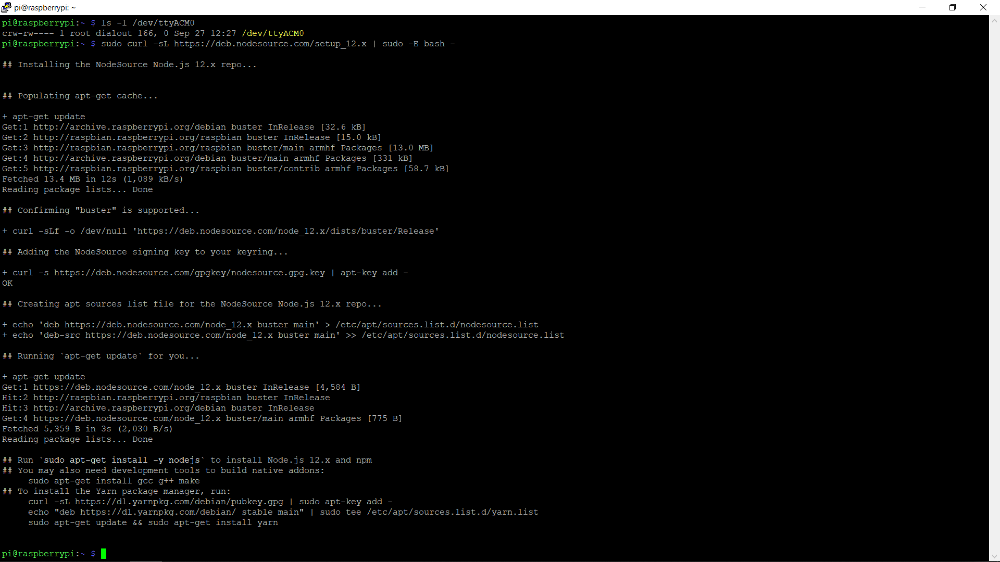

```bash
$ sudo apt-get install -y nodejs git make g++ gcc
```
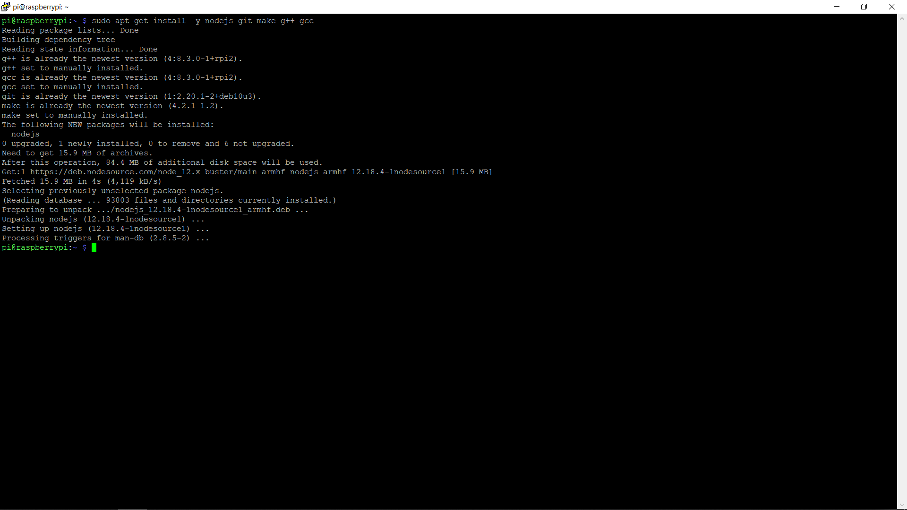

Sau khi cài đặt xong, có thử kiểm tra xem Nodejs đã được cài thành công hay chưa bằng lệnh:

```bash
$ node --version
$ npm --version
```

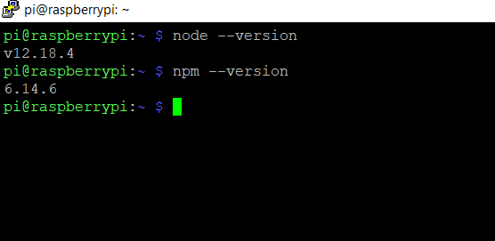

* **Bước 4**: Tải Zigbee2MQTT và thay đổi quyền truy cập vào thư mục chứa server MQTT.

```bash
$ sudo git clone https://github.com/Koenkk/zigbee2mqtt.git /opt/zigbee2mqtt
$ sudo chown -R pi:pi /opt/zigbee2mqtt
```

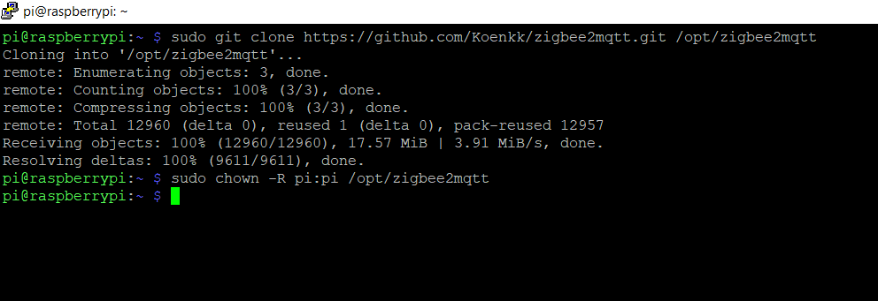

* **Bước 5**: Cài đặt các Independency cho Zigbee2MQTT.

```bash
$ cd /opt/zigbee2mqtt
$ npm ci
```

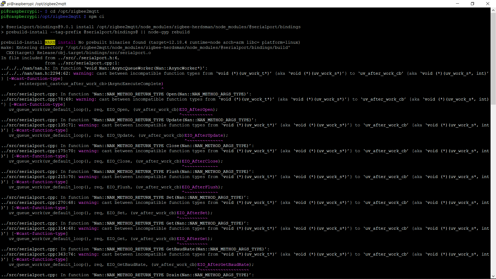

* **Bước 6**: Tùy chỉnh cấu hình của Zigbee2MQTT bằng cách chỉnh sửa file `configuration.yaml` (có thể để mặc định).

```bash
$ sudo nano /opt/zigbee2mqtt/data/configuration.yaml
```

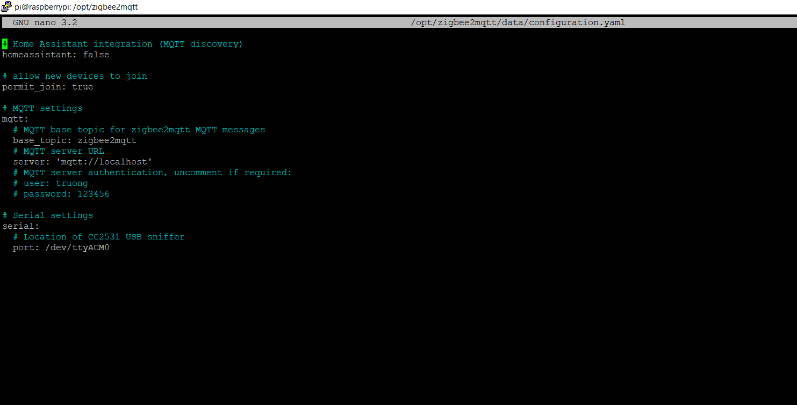

* **Bước 7**: Cài đặt Broker (ở đây ta sử dụng Mosquitto) để quản lý các kết nối.

```bash
$ sudo apt-get install mosquitto
```

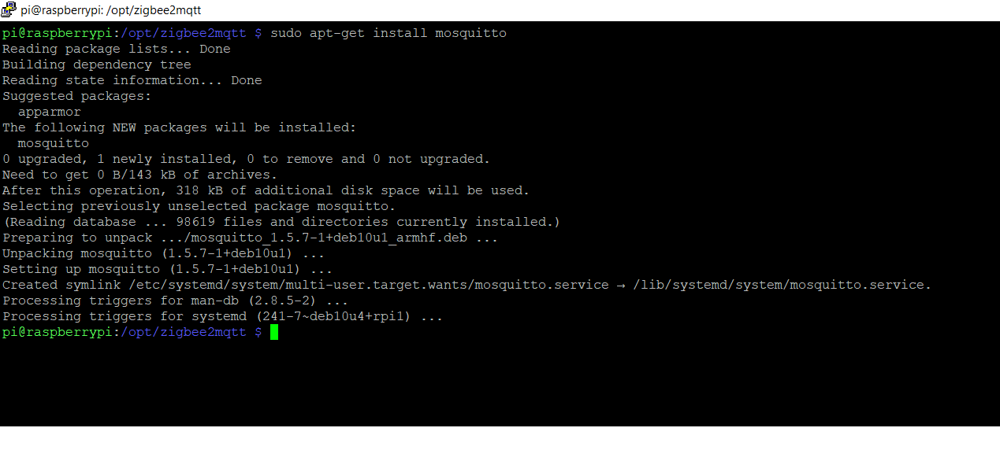

* **Bước 8**: Khởi động Zigbee Gateway, cho phép các thiết bị kết nối thông qua Zigbee Gateway.

```bash
$ cd /opt/zigbee2mqtt
$ npm start
```
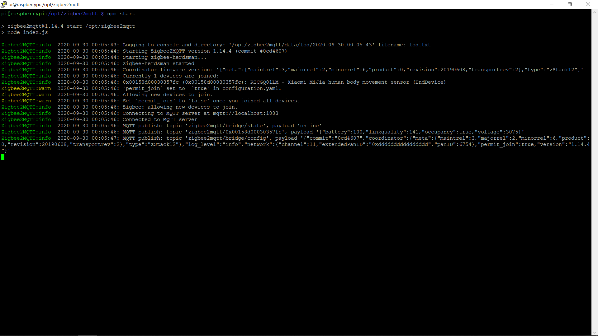

Khi có thiết bị Zigbee kết nối, Broker sẽ tự động ghi nhận và hiển thị thông tin của thiết bị vừa kết nối. Ví dụ, khi cảm biến chuyển động RTCGQ01LM kết nối vào Zigbee gateway.

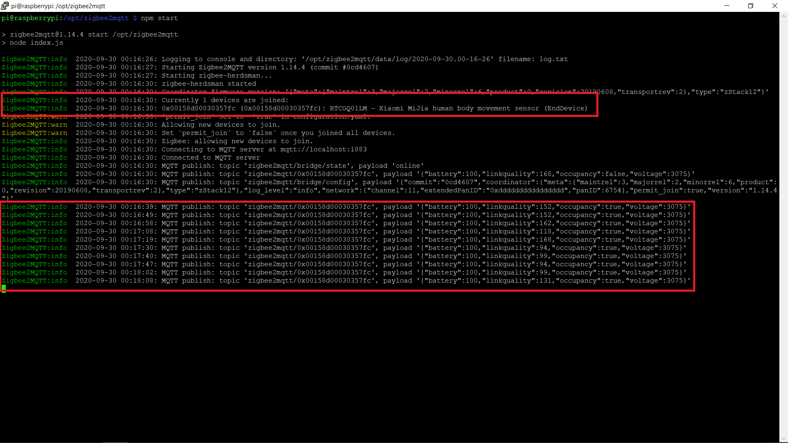
